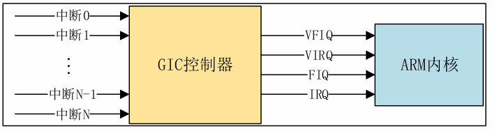
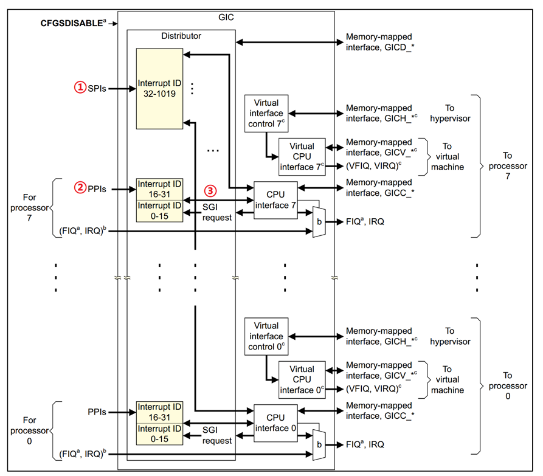
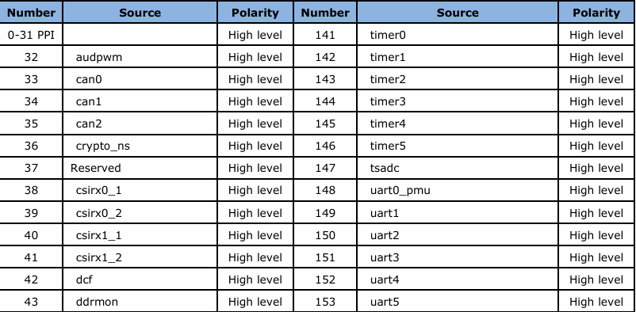

## 简介 

简单介绍一下中断，就是一种对于某个事件的响应，然后执行对应响应的函数。在linux驱动编写的时候同样也需要中断。

## 中断API函数

在单片机中常见的中断处理方法

1. 使能中断，初始化对应的寄存器
2. 编写中断服务函数，中断发生后相应的中断服务函数就会执行

以下是中断的API函数

1. request_irq 中断请求函数

```C
int request_irq(unsigned int  irq,  
				irq_handler_t handler,  
				unsigned long flags, 
				const char    *name,  
				void   *dev)
```

* irq：要申请中断的中断号。
* handler：中断处理函数，当中断发生以后就会执行此中断处理函数。
* flags：中断标志，可以在文件include/linux/interrupt.h 里面查看所有的中断标志，这里我们
  介绍几个常用的中断标志


| 标志                   | 描述                                                                                                                      |
| ------------------------ | --------------------------------------------------------------------------------------------------------------------------- |
| `IRQF_SHARED`          | 多个设备共享同一中断线时使用。共享该中断的所有设备都必须指定此标志，`request_irq()` 中的 `dev` 参数通常用于区分不同设备。 |
| `IRQF_ONESHOT`         | 常用于线程化中断，要求在线程化中断处理函数执行完成前保持该中断线被屏蔽，避免重复进入。                                    |
| `IRQF_TRIGGER_NONE`    | 不指定额外的中断触发方式。                                                                                                |
| `IRQF_TRIGGER_RISING`  | 上升沿触发中断。                                                                                                          |
| `IRQF_TRIGGER_FALLING` | 下降沿触发中断。                                                                                                          |
| `IRQF_TRIGGER_HIGH`    | 高电平触发中断。                                                                                                          |
| `IRQF_TRIGGER_LOW`     | 低电平触发中断。                                                                                                          |

而上述这些标志可以用 “|” 的方式进行组合

3. free_irq 中断释放函数

使用中断时需要通过 `request_irq` 函数申请，使用完成以后需要通过 `free_irq` 函数释放相应的中断。如果中断不是共享的，`free_irq` 会删除中断处理函数并禁止中断。

```C
void free_irq(unsigned int irq,
              void *dev_id);
```

* irq：要释放的中断号。
* dev_id：如果中断设置为共享（`IRQF_SHARED`），此参数用来区分具体的中断，需要与申请中断时传入的 `dev_id` 保持一致。共享中断只有在释放最后一个中断处理函数时才会被禁止。
* 返回值：无。

4. 中断处理函数

使用 `request_irq` 函数申请中断时，需要设置中断处理函数，其格式如下：

```C
irqreturn_t (*irq_handler_t)(int, void *);
```

* 第一个参数：中断处理函数要响应的中断号。
* 第二个参数：指向 `void` 的通用指针，需要与 `request_irq` 函数的 `dev_id` 参数保持一致，用于区分共享中断的不同设备，也可以指向设备数据结构。
* 返回值：`irqreturn_t` 类型。

`irqreturn_t` 是一个枚举类型，定义如下：

```C
enum irqreturn {
    IRQ_NONE        = (0 << 0),
    IRQ_HANDLED     = (1 << 0),
    IRQ_WAKE_THREAD = (1 << 1),
};

typedef enum irqreturn irqreturn_t;
```

一共有三种返回值。一般中断服务函数使用如下形式返回：

```C
return IRQ_RETVAL(IRQ_HANDLED);
```

5. 中断使能与禁止函数

常用的中断使能与禁止函数如下：

```C
void enable_irq(unsigned int irq);
void disable_irq(unsigned int irq);
```

* irq：要使能或禁止的中断号。
* 返回值：无。

`enable_irq` 用于使能指定的中断，`disable_irq` 用于禁止指定的中断。`disable_irq` 会等待当前正在执行的中断处理函数执行完毕后才返回。

如果需要禁止中断后立即返回，不等待当前中断处理程序执行完毕，可以使用 `disable_irq_nosync`：

```C
void disable_irq_nosync(unsigned int irq);
```

* irq：要禁止的中断号。
* 返回值：无。

`disable_irq_nosync` 调用后立即返回，不会等待当前中断处理程序执行完毕。

以上三个函数用于使能或禁止某一个中断。如果需要使能或禁止当前处理器的中断系统，可以使用以下函数：

```C
local_irq_enable();
local_irq_disable();
```

* 参数：无。
* 返回值：无。

`local_irq_enable` 用于使能当前处理器的中断系统，`local_irq_disable` 用于禁止当前处理器的中断系统。

在需要保留原有中断状态的场景中，直接调用 `local_irq_enable` 可能会将原本已关闭的中断打开。因此，应保存中断状态，并在操作结束后恢复原有状态，使用以下配对函数：

```C
local_irq_save(flags);
local_irq_restore(flags);
```

* flags：用于保存中断状态的变量。
* 返回值：无。

`local_irq_save` 用于禁止当前处理器的中断，并将原有中断状态保存在 `flags` 中；`local_irq_restore` 用于将中断状态恢复为 `flags` 保存的状态。

## 上半部和下半部

为了解决有些情况下，必不可少的要在中断当中处理耗时的任务，因此将中断分为了上半部和下半部

* 上半部: 就是中断处理函数，那些处理过程比较快，不会占用很长时间的处理就可
  以放在上半部完成
* 下半部: 如果中断处理过程比较耗时，那么就将这些比较耗时的代码提出来，交给下半部去执行，这样中断处理函数就会快进快出。

然而在实际编写驱动的时候我们该如何进行选择将处理的函数写在上半部还是下半部呢，以下为正点原子的经验之谈

①、如果要处理的内容不希望被其他中断打断，那么可以放到上半部。
②、如果要处理的任务对时间敏感，可以放到上半部。
③、如果要处理的任务与硬件有关，可以放到上半部
④、除了上述三点以外的其他任务，优先考虑放到下半部。

### 软中断

一开始Linux内核提供了“bottom half”机制来实现下半部，简称“BH”。后面引入了软中断和tasklet来替代“BH”机制，完全可以使用软中断和tasklet来替代BH，从2.5版本的Linux内核开始BH已经被抛弃了。Linux内核使用结构体softirq_action表示软中断， softirq_action结构体定义在文件include/linux/interrupt.h中

```C
491 struct softirq_action 
492 { 
493     void    (*action)(struct softirq_action *); 
494 };
```

而在softirq.c 中一共定义了10个软中断

```C
static struct softirq_action softirq_vec[NR_SOFTIRQS];
```

```C
enum 
{ 
    HI_SOFTIRQ=0,            /* 高优先级软中断   */ 
    TIMER_SOFTIRQ,           /* 定时器软中断    */ 
    NET_TX_SOFTIRQ,          /* 网络数据发送软中断  */ 
    NET_RX_SOFTIRQ,          /* 网络数据接收软中断  */ 
    BLOCK_SOFTIRQ,       
    IRQ_POLL_SOFTIRQ,  
    TASKLET_SOFTIRQ,         /* tasklet软中断   */ 
    SCHED_SOFTIRQ,           /* 调度软中断    */ 
    HRTIMER_SOFTIRQ,         /* 高精度定时器软中断 */ 
    RCU_SOFTIRQ,             /* RCU软中断   */ 
 
    NR_SOFTIRQS 
};
```

1. open_softirq 软中断注册函数

使用 `open_softirq` 函数注册软中断对应的处理函数，函数原型如下：

```C
void open_softirq(int nr, void (*action)(struct softirq_action *));
```

* nr：要开启的软中断，从上面的软中断枚举类型中选择。
* action：软中断对应的处理函数。
* 返回值：无。

2. raise_softirq 软中断触发函数

注册好软中断以后，需要通过 `raise_softirq` 函数触发，函数原型如下：

```C
void raise_softirq(unsigned int nr);
```

* nr：要触发的软中断，从上面的软中断枚举类型中选择。
* 返回值：无。

3. softirq_init 软中断初始化函数

软中断必须在编译时静态注册。Linux 内核使用 `softirq_init` 函数初始化软中断，该函数定义在 `kernel/softirq.c` 文件中，内容如下：

```C
void __init softirq_init(void)
{
    int cpu;

    for_each_possible_cpu(cpu) {
        per_cpu(tasklet_vec, cpu).tail =
            &per_cpu(tasklet_vec, cpu).head;
        per_cpu(tasklet_hi_vec, cpu).tail =
            &per_cpu(tasklet_hi_vec, cpu).head;
    }

    open_softirq(TASKLET_SOFTIRQ, tasklet_action);
    open_softirq(HI_SOFTIRQ, tasklet_hi_action);
}
```

* 参数：无。
* 返回值：无。

从上述代码可以看出，`softirq_init` 函数默认会打开 `TASKLET_SOFTIRQ` 和 `HI_SOFTIRQ`。

### tasklet

利用软中断实现的另外一种下半部机制，更推荐使用tasklet，其下为tasklet的结构体

```C
542 struct tasklet_struct 
543 { 
544     struct tasklet_struct *next;    /* 下一个tasklet    */ 
545     unsigned long state;             /* tasklet状态       */ 
546     atomic_t count;                  /* 计数器，记录对tasklet的引用数 */ 
547     void (*func)(unsigned long);    /* tasklet执行的函数   */ 
548     unsigned long data;              /* 函数func的参数    */ 
549 };
```

而对于tasklet的API函数为

```C
void tasklet_init(struct tasklet_struct  *t, 
     			  void (*func)(unsigned long),  
     			  unsigned long  data);
```

* t：要初始化的tasklet
* func：tasklet的处理函数。
* data：要传递给func函数的参数
* 返回值：没有返回值。

也可以使用宏DECLARE_TASKLET来一次性完成tasklet的定义和初始化，DECLARE_TASKLET定义在include/linux/interrupt.h文件中，定义如下:

```C
DECLARE_TASKLET(name, func, data)
```

2. tasklet_schedule 函数

```C
void tasklet_schedule(struct tasklet_struct *t)
```

* t：要调度的tasklet，也就是DECLARE_TASKLET宏里面的name。
* 返回值：没有返回值。

### 工作队列

工作队列和tasklet和软中断的区别就是允许在处理函数当中睡眠或者重新调度，由于工作队列是在另外一个进程上，所以允许睡眠或重新调度。而tasklet和软中断则是直接运行在操作系统上，因此不能由任何的阻塞。

Linux内核使用work_struct结构体表示一个工作

```C
struct work_struct { 
    atomic_long_t data;   
    struct list_head entry;  
    work_func_t func;        /* 工作队列处理函数  */ 
};
```

这些工作组织成工作队列，工作队列使用workqueue_struct结构体表示

```C
struct workqueue_struct { 
    struct list_head     pwqs;      
    struct list_head     list;      
    struct mutex         mutex;     
    int             work_color;  
    int             flush_color;   
    atomic_t          nr_pwqs_to_flush;  
    struct wq_flusher    *first_flusher;  
    struct list_head     flusher_queue;   
    struct list_head     flusher_overflow; 
    struct list_head     maydays;   
    struct worker        *rescuer;  
    int             nr_drainers;   
    int             saved_max_active;  
    struct workqueue_attrs  *unbound_attrs;  
    struct pool_workqueue   *dfl_pwq;  
    char               name[WQ_NAME_LEN];  
    struct rcu_head      rcu; 
    unsigned int         flags ____cacheline_aligned;  
    struct pool_workqueue __percpu *cpu_pwqs;  
    struct pool_workqueue __rcu *numa_pwq_tbl[];  
};
```

Linux内核使用工作者线程(worker thread)来处理工作队列中的各个工作，Linux内核使用worker结构体表示工作者线程

```C
struct worker {
     union { 
        struct list_head     entry;   
        struct hlist_node    hentry;  
    }; 
 
    struct work_struct    *current_work;   
    work_func_t        current_func;  
    struct pool_workqueue    *current_pwq;  
    struct list_head      scheduled;   
    struct task_struct    *task;     
    struct worker_pool    *pool;     
    struct list_head      node;      
    unsigned long         last_active;   
    unsigned int          flags;     
    int              id;    
    int              sleeping;  
    char                desc[WORKER_DESC_LEN]; 
    struct workqueue_struct  *rescue_wq; 
    work_func_t        last_func; 
};
```

每个worker都有一个工作队列，工作者线程处理自己工作队列中的所有工作。简单创建工作很简单，直接定义一个work_struct结构体变量即可，然后使用INIT_WORK宏来初始化工作，INIT_WORK宏定义如下

```C
#define INIT_WORK(_work, _func)
```

_work表示要初始化的工作，_func是工作对应的处理函数。

```C
#define DECLARE_WORK(n, f)
```

n表示定义的工作(work_struct)，f表示工作对应的处理函数。

和tasklet一样，工作也是需要调度才能运行的，工作的调度函数为schedule_work，函数原型如下所示：

```C
bool schedule_work(struct work_struct *work)
```

* work：要调度的工作。
*  返回值：0 成功，其他值 失败

## 设备树中断信息节点

### GIC中断控制器

GIC是ARM公司给Cortex-A/R内核提供的一个中断控制器，类似Cortex-M内核中的
NVIC。V2~V4目前正在大量的使用。GIC V2是给ARMv7-A架构使用的，比如Cortex-A7、Cortex-A9、Cortex-A15等，V3和V4是给ARMv8-A/R架构使用的，也就是64位芯片使用的



* VFIQ:虚拟快速FIQ。
* VIRQ:虚拟快速IRQ。
* FIQ:快速中断IRQ。
* IRQ:外部中断IRQ。

我们现在考虑GIC如何将IRQ信号上报给ARM内核



左侧部分就是中断源，中间部分就是GIC控制器，最右侧就是中断控制器向处理器内核发送中断信息。我们重点要看的肯定是中间的GIC部分，GIC将众多的中断源分为
分为三类

* SPI(Shared Peripheral Interrupt),共享中断，顾名思义，所有 Core 共享的中断，这个是最常见的，那些外部中断都属于SPI中断(注意！不是SPI总线那个中断) 。比如GPIO中断、串口中断等等，这些中断所有的Core都可以处理，不限定特定Core。
* PPI(Private Peripheral Interrupt)，私有中断，我们说了 GIC 是支持多核的，每个核肯定有自己独有的中断。这些独有的中断肯定是要指定的核心处理，因此这些中断就叫做私有中断。
* SGI(Software-generated Interrupt)，软件中断，由软件触发引起的中断，通过向寄存器GICD_SGIR 写入数据来触发，系统会使用SGI中断来完成多核之间的通信。

### 中断ID

每一个CPU最多支持1020个中断ID，中断ID号为ID0~ID1019。这1020个ID包
含了PPI、SPI和SGI

ID0 ~ ID15：这 16个ID分配给SGI。
ID16 ~ ID31：这 16 个ID分配给PPI。
ID32 ~ ID1019：这 988 个 ID 分配给SPI，像 GPIO中断、串口中断等这些外部中断 ，至于具体到某个ID 对应哪个中断那就由半导体厂商根据实际情况去定义了。

比如RK3568的中断ID对应的中断源



### ＧＩＣ控制节点

在rk3568.dtsi当中其GIC控制节点如下

```C
	gic: interrupt-controller@fd400000 {
		compatible = "arm,gic-v3";
		#interrupt-cells = <3>;
		#address-cells = <2>;
		#size-cells = <2>;
		ranges;
		interrupt-controller;

		reg = <0x0 0xfd400000 0 0x10000>, /* GICD */
		      <0x0 0xfd460000 0 0xc0000>; /* GICR */
		// <中断类型 中断号 标志>
		interrupts = <GIC_PPI 9 IRQ_TYPE_LEVEL_HIGH>;
		its: interrupt-controller@fd440000 {
			compatible = "arm,gic-v3-its";
			msi-controller;
			#msi-cells = <1>;
			reg = <0x0 0xfd440000 0x0 0x20000>;
		};
	};
```

总结一下与中断有关的设备树属性信息：

①、#interrupt-cells，指定中断源的信息cells 个数。
②、interrupt-controller，表示当前节点为中断控制器。
③、interrupts，指定中断号，触发方式等。
④、interrupt-parent，指定父中断，也就是中断控制器。

### 获取中断号

1. irq_of_parse_and_map函数

```C
unsigned int irq_of_parse_and_map(struct device_node *dev, int index)
```

* dev：设备节点。
* index：索引号，interrupts 属性可能包含多条中断信息，通过index指定要获取的信息。
* 返回值：中断号。

2. gpio_to_irq函数 获取GPIO对应中断号

```C
int gpio_to_irq(unsigned int gpio)
```

* gpio：要获取的GPIO编号。
* 返回值：GPIO对应的中断号。
