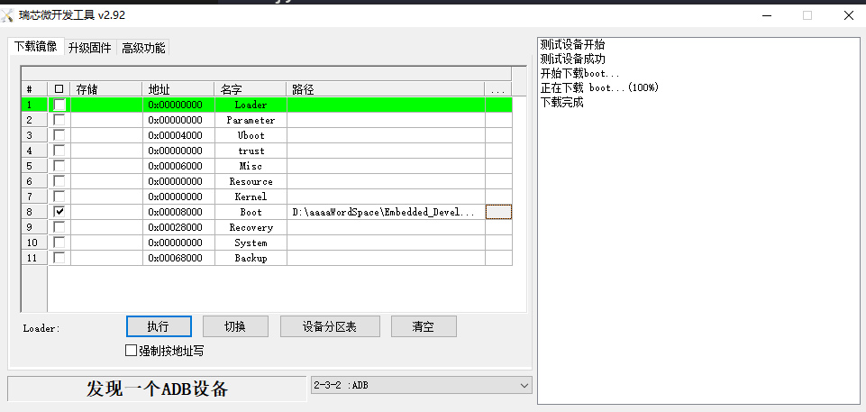

## 设备树节点添加

现在我们引入设备树对LED的驱动进行抽象，我们在设备树的根节点 "/" 下创建一个LED驱动子节点

```C
	rk3568_led {
		compatible = "rk3568_dts_led"; // 设置led驱动兼容名
		status = "okay"; // 状态设置为 OK
		// PMU_GRF_GPIO0C_IOMUX_L 设置引脚复用
		// PMU_GRF_GPIO0C_DS_0    设置引脚输出能力
		// GPIO_SWPORT_DR_H		  设置引脚输出电平
		// GPIO_SWPORT_DDR_H	  设置引脚输入输出方向
		reg = <0x0 0xFDC20010 0x0 0x08
		 	   0x0 0xFDC20090 0x0 0x08
			   0x0 0xFDD60004 0x0 0x08
			   0x0 0xFDD6000C 0x0 0x08
				>;
	};
```

并对内核重新编译

```Shell
./build.sh kernel
```

经过漫长的等待，得到最后的boot.img, 我是用RK官方的烧录工具，将板卡设置为Loader模式



并执行烧录，烧录后进行在设备终端对配置的设备节点进行查看

```Shell
root@ATK-DLRK3568:/proc/device-tree# ls -lh rk3568_led
total 0
-r--r--r-- 1 root root 15 Sep 28 20:55 compatible
-r--r--r-- 1 root root 11 Sep 28 20:55 name
-r--r--r-- 1 root root 64 Sep 28 20:55 reg
-r--r--r-- 1 root root  5 Sep 28 20:55 status
root@ATK-DLRK3568:/proc/device-tree# cat compatible
rockchip,rk3568-evb1-ddr4-v10rockchip,rk3568
```

最终可以验证，设备树节点确实已经写入到内核当中。

## 设备节点驱动编写

对此我们有了配置好的设备树，我们就可以根据配置的设备树节点进行内核驱动模块的编写，可以参考FUCK5章节的编写内容。

驱动源代码

```C
#include "include/fp_led.h"

struct led_dts_type dtsled; // 实例化字符设备

// 物理地址 -> 虚拟地址
void addr2virtual(uint32_t *reg)
{
    dtsled.gpio_iomux_addr = ioremap(reg[1],  reg[3]); 
    dtsled.gpio_ds_addr    = ioremap(reg[5],  reg[7]);
    dtsled.swport_dr_addr  = ioremap(reg[9],  reg[11]);
    dtsled.swport_ddr_addr = ioremap(reg[13], reg[15]);
}

// 取消虚拟地址映射
void led_iounmap(void)
{
    iounmap(dtsled.gpio_iomux_addr);
    iounmap(dtsled.gpio_ds_addr);
    iounmap(dtsled.swport_ddr_addr);
    iounmap(dtsled.swport_dr_addr);
}


static int __init led_dts_driver_init(void)
{
    int ret = 0;
    struct property *proper;
    const char* str;
    uint32_t reg_data[16];
    uint32_t value = 0x00;
    uint8_t i = 0;

    // 获取设备树中的属性数据
    dtsled.nd = of_find_node_by_path(NODE_PATH);
    if (dtsled.nd == NULL)
    {
        printk("%s node not find \r\n", NODE_PATH);
        goto fail_find_node;
    }
    else
    {
        printk("find node %s", NODE_PATH);
    }   

    // 获取compatible内容
    proper = of_find_property(dtsled.nd, "compatible", NULL);
    if (proper == NULL)
    {
        printk("compatible property find failed \r\n");
    }
    else
    {
        printk("compatible: %s \r\n", (char *)proper->value);
    }

    // 获取status内容
    ret = of_property_read_string(dtsled.nd, "status", &str);
    if (ret < 0)
    {
        printk("status read failed \r\n");
    }
    else
    {
        printk("status: %s \r\n", str);
    }
  
    // 获取reg属性内容
    ret = of_property_read_u32_array(dtsled.nd, "reg", reg_data, 16);
    if (ret < 0)
    {
        printk("failed to read reg \r\n");
    }
    else
    {
        printk("reg data: \r\n");
        for (i = 0; i < 16; i++)
        {
            printk("%#X", reg_data[i]);
        }   
        printk("\r\n");
    }
    // 寄存器物理地址映射虚拟地址
    addr2virtual(reg_data);
    // 初始化寄存器配置 
    // 设置引脚复用
    value = ioread32(dtsled.gpio_iomux_addr);
    value |= 0x07 << 16; // 使能读写
    value &= 0xFFFFFFF8; // 选择GPIO0C 不复用  
    iowrite32(value, dtsled.gpio_iomux_addr);
    // 设置gpio驱动能力 GPIO0_C0
    // 低六位为能力驱动, 设置为最高 0b111111
    // 使能高六位读写权限
    value = ioread32(dtsled.gpio_ds_addr);
    value |= 0x3F << 16;
    value |= 0x3F;
    iowrite32(value,dtsled.gpio_ds_addr);
    // 设置GPIO默认输出电平  
    value = ioread32(dtsled.swport_dr_addr);
    value |= 0x01 << 16; // 使能写
    value |= 0x01; // 默认为高电平
    iowrite32(value, dtsled.swport_dr_addr);
    // 设置GPIO输出方向
    value = ioread32(dtsled.swport_ddr_addr);
    value |= 0x01 << 16;
    value |= 0x01;
    iowrite32(value, dtsled.swport_ddr_addr);

    ret = alloc_chrdev_region(&dtsled.dev_id, 0, LED_CNT, CHR_NAME);
    if (ret < 0)
    {
        printk("alloc dev id failed \r\n");
        goto alloc_err;
    }
    dtsled.major = MAJOR(dtsled.dev_id);
    dtsled.minor = MINOR(dtsled.dev_id);
    printk("major: %d minor: %d", MAJOR(dtsled.dev_id), MINOR(dtsled.dev_id));
    // 初始化字符设备
    cdev_init(&dtsled.cdev, get_fp());
    dtsled.cdev.owner = THIS_MODULE;
    // 添加字符设备到散列表
    ret = cdev_add(&dtsled.cdev, dtsled.dev_id, LED_CNT);
    if (ret < 0)
    {
        printk("failed to add cdev \r\n");
        goto add_fail; 
    }
    // 创建类
    dtsled.class = class_create(THIS_MODULE, CHR_NAME);
    if (IS_ERR(dtsled.class))
    {
        printk("failed to create class \r\n");
        goto class_err;
    }
    // 设备类
    dtsled.device = device_create(dtsled.class, NULL, dtsled.dev_id, 
                                  NULL, CHR_NAME);
    if (IS_ERR(dtsled.device))
    {
        printk("failed to create device \r\n");
        goto device_err;
    }
    printk("dts led module init success \r\n");
    return 0;
device_err:
    device_destroy(dtsled.class, dtsled.dev_id);
class_err:
    class_destroy(dtsled.class);
add_fail:
    cdev_del(&dtsled.cdev);
alloc_err:
    led_iounmap();
fail_find_node:
    return -EIO;
}

static void __exit led_dts_driver_deinit(void)
{
    printk("exit led dts driver \r\n");
    device_destroy(dtsled.class, dtsled.dev_id);
    class_destroy(dtsled.class);
    cdev_del(&dtsled.cdev);
    led_iounmap();
}


module_init(led_dts_driver_init);
module_exit(led_dts_driver_deinit);

MODULE_LICENSE("GPL");
```

文件操作源代码

```C
#include "include/fp_led.h"

static int fp_led_open (struct inode *inode, struct file *filp);
static int fp_led_release (struct inode *inode, struct file *filp);
ssize_t fp_led_write (struct file *filp, const char __user *buf, size_t cnt, loff_t *loff);

struct file_operations fp = 
{
    .open = fp_led_open,
    .release = fp_led_release,
    .read = NULL,
    .write = fp_led_write,
};

static int fp_led_open (struct inode *inode, struct file *filp)
{
    struct led_dts_type *dtsled = container_of(inode->i_cdev, struct led_dts_type, cdev);
    filp->private_data = dtsled;
    printk("fp dts led open \r\n");
    return 0;
}

static void fp_led_switch_state(struct led_dts_type *dev, int ret)
{
    uint32_t value = 0x00;
    value |= 0x01 << 16; // 使能写
    switch (ret) 
    {
    case LED_ON:
        value |= 0x01; // 默认为高电平
        printk("fp turn on \r\n");
        iowrite32(value, dev->swport_dr_addr);
        break;
    case LED_OFF:
        value |= 0x00; // 默认为高电平
        printk("fp turn off \r\n");
        iowrite32(value, dev->swport_dr_addr);
        break;
    default:
        printk("Unknown ret \r\n");
    }
}


ssize_t fp_led_write (struct file *filp, const char __user *buf, size_t cnt, loff_t *loff)
{
    int ret = 0;
    struct led_dts_type *dev = filp->private_data;
    get_user(ret, buf);
    printk("ret: %d \r\n", ret);
    fp_led_switch_state(dev, ret);
    return 0;
}

static int fp_led_release (struct inode *inode, struct file *filp)
{
    printk("exit fp dts led \r\n");
    return 0;
}


struct file_operations* get_fp(void)
{
    return &fp;
}
```

文件操作头文件

```C
#ifndef __FP_LED_H
#define __FP_LED_H

#include <linux/kernel.h>
#include <linux/init.h>
#include <linux/module.h>
#include <linux/cdev.h>
#include <linux/of.h>
#include <linux/io.h>

#define LED_CNT  (1)
#define CHR_NAME ("drvled")
#define NODE_PATH ("/rk3568_led")
#define LED_ON   (1)
#define LED_OFF  (0)


struct led_dts_type
{
    struct cdev cdev;      // 字符设备结构体
    dev_t dev_id;          // 设备号
    struct class *class;   // 类
    struct device *device; // 设备
    int major;             // 主设备号
    int minor;             // 从设备号
    struct device_node *nd;// 设备节点
    uint32_t __iomem *gpio_iomux_addr; // 复用IO寄存器
    uint32_t __iomem *gpio_ds_addr;    // 驱动能力寄存器
    uint32_t __iomem *swport_dr_addr;  // 驱动电平寄存器
    uint32_t __iomem *swport_ddr_addr; // IO输入输出方向寄存器
};

struct file_operations* get_fp(void);


#endif
```

测试应用源代码

```C
#include <stdio.h>
#include <fcntl.h>
#include <unistd.h>

#define LED_ON  (1)
#define LED_OFF (0)

int main(int argc, char *argv[])
{
    int fd = 0;
    int value = 0;
    printf("led_dts_test_app \r\n");
    char *chr_path;
    if (argc < 2)
    {
        printf("error arg use \r\n");
        return -1;
    }
    chr_path = argv[1];
    fd = open(chr_path, O_RDWR);
    while (1)
    {
        printf("LED ON \r\n");
        value = LED_ON;
        write(fd, &value, 1);
        sleep(1);
        printf("LED OFF \r\n");
        value = LED_OFF;
        write(fd, &value, 1);
        sleep(1);
    }
    close(fd);
    return 0;
}
```

Makefile

```CMake
# 内核路径
KERNEL_DIR = ../.. 
# 目标架构
ARCH = arm64
# 交叉编译工具链
CROSS_COMPILE = aarch64-linux-gnu-
# 导出环境变量
export ARCH CROSS_COMPILE

ccflags-y += -I$(src)/include
obj-m += led_dts_module.o
led_dts_module-y := led_dts_driver.o fp_led.o

test_app = led_dts_test_app

all:
	$(MAKE) -C $(KERNEL_DIR) M=$(CURDIR) modules
	$(CROSS_COMPILE)gcc -std=gnu11 -Wall -Wextra -o $(test_app) $(test_app).c

.PHONY: clean
clean:
	$(MAKE) -C $(KERNEL_DIR) M=$(CURDIR) clean
	rm -f $(test_app)
```

驱动代码的编写流程很死，再编写字符驱动代码时需要严格保证在出现加载模块或者运行出错时是否把该释放的资源全部释放了。我的做法是栈式释放流程，也就是越往后初始化的越先释放。
