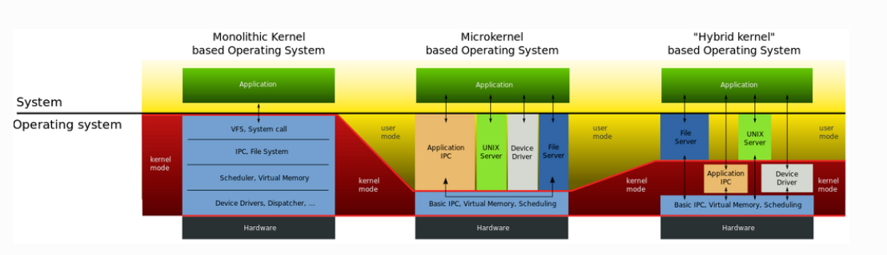

## 啥是内核模块

啥是内核模块？很简单通俗的来讲，为了让linux内核编译后的体积不过于庞大，灵活的对各个功能按需要进行裁剪或者是加载，不影响linux内核的调度。将每个功能作为一个可嵌入模块并可进行单独编译，非常适合前期程序调试。

而是什么决定了linux内核需要用户可以灵活的配置内核模块，其关键决定是内核的体系结构

* 微内核结构: 只提供操作系统核心功能，比如进程管理、I/O设备管理、进程通信等基础性操作系统功能，而应用层IPC、设备驱动模块等并不包含在内核功能当中，因此微内核具有动态扩展性强的特点，典型例子 Windows 、鸿蒙
* 宏内核结构: 包括微内核以及微内核之外的应用层IPC、文件系统功能、设备驱动模块都编译成一个整体。而Linux就是典型代表
* 混合内核结构: 把微内核的模块化设计和宏内核的高性能结合起来，将关键服务放在内核态运行，同时保留一定的模块隔离与可扩展性。



因此通过引入内核模块的形式解耦linux内核与驱动的代码。

## 内核模块文件构成

首先我们可以知道内核模块的文件以 .ko 为结尾，可以使用

```Shell
#查看上一次章节编译生成的驱动模块
file helloworld.ko

#信息输出如下
helloworld.ko: ELF 64-bit LSB relocatable, ARM aarch64, version 1 (SYSV), BuildID[sha1]=bc8bd8252d55812798342354a5953d03af2321e5, with debug_info, not stripped
```

得到启示内核模块底层文件格式是 ELF文件，也就是可以重定位目标的文件，我们可以通过 readelf -h **.ko 的方式读取内核模块的头部详细信息

```Shell
# 查看elf 头部详细信息
readelf -h hello.ko

# 信息输出结果
ELF Header:
  Magic:   7f 45 4c 46 02 01 01 00 00 00 00 00 00 00 00 00 
  Class:                             ELF64
  Data:                              2's complement, little endian
  Version:                           1 (current)
  OS/ABI:                            UNIX - System V
  ABI Version:                       0
  Type:                              REL (Relocatable file)
  Machine:                           AArch64
  Version:                           0x1
  Entry point address:               0x0
  Start of program headers:          0 (bytes into file)
  Start of section headers:          133976 (bytes into file)
  Flags:                             0x0
  Size of this header:               64 (bytes)
  Size of program headers:           0 (bytes)
  Number of program headers:         0
  Size of section headers:           64 (bytes)
  Number of section headers:         37
  Section header string table index: 36
```

ELF文件的段结构就是由段表决定的，编译器、链接器、装载器都是依靠段表来定位和访问各个段的属性的，包含了描述文件节区的信息。而我们使用 readelf -S *.ko 可以读取elf文件节区头部表更详细的信息

```Shell
#-S参数读取elf文件的节区头部表的详细信息
readelf -S hello.ko

# 输出信息结果如下
There are 37 section headers, starting at offset 0x20b58:

Section Headers:
  [Nr] Name              Type             Address           Offset
       Size              EntSize          Flags  Link  Info  Align
  [ 0]                   NULL             0000000000000000  00000000
       0000000000000000  0000000000000000           0     0     0
  [ 1] .note.gnu.bu[...] NOTE             0000000000000000  00000040
       0000000000000024  0000000000000000   A       0     0     4
  [ 2] .note.Linux       NOTE             0000000000000000  00000064
       0000000000000018  0000000000000000   A       0     0     4
  [ 3] .text             PROGBITS         0000000000000000  0000007c
       0000000000000000  0000000000000000  AX       0     0     1
  [ 4] .init.text        PROGBITS         0000000000000000  0000007c
       0000000000000028  0000000000000000  AX       0     0     4
  [ 5] .rela.init.text   RELA             0000000000000000  00011c00
       0000000000000048  0000000000000018   I      34     4     8
  [ 6] .exit.text        PROGBITS         0000000000000000  000000a4
       000000000000001c  0000000000000000  AX       0     0     4
  [ 7] .rela.exit.text   RELA             0000000000000000  00011c48
       0000000000000048  0000000000000018   I      34     6     8
  [ 8] __patchable_[...] PROGBITS         0000000000000020  000000c0
       0000000000000008  0000000000000000 WAL       4     0     8
  [ 9] .rela__patch[...] RELA             0000000000000000  00011c90
       0000000000000018  0000000000000018   I      34     8     8
  [10] .data             PROGBITS         0000000000000000  000000c8
       0000000000000000  0000000000000000  WA       0     0     1
  [11] .gnu.linkonc[...] PROGBITS         0000000000000000  00000100
       0000000000000380  0000000000000000  WA       0     0     64
  [12] .rela.gnu.li[...] RELA             0000000000000000  00011ca8
       0000000000000030  0000000000000018   I      34    11     8
  [13] .plt              PROGBITS         0000000000000000  00000480
       0000000000000001  0000000000000000  AX       0     0     1
  [14] .init.plt         PROGBITS         0000000000000000  00000481
       0000000000000001  0000000000000000   A       0     0     1
  [15] .text.ftrace[...] PROGBITS         0000000000000000  00000482
       0000000000000001  0000000000000000  AX       0     0     1
  [16] .rodata.str1.8    PROGBITS         0000000000000000  00000488
       000000000000002c  0000000000000001 AMS       0     0     8
  [17] .modinfo          PROGBITS         0000000000000000  000004b4
       000000000000008b  0000000000000000   A       0     0     1
  [18] .bss              NOBITS           0000000000000000  0000053f
       0000000000000000  0000000000000000  WA       0     0     1
  [19] .note.GNU-stack   PROGBITS         0000000000000000  0000053f
       0000000000000000  0000000000000000           0     0     1
  [20] .comment          PROGBITS         0000000000000000  0000053f
       000000000000005c  0000000000000001  MS       0     0     1
  [21] .debug_info       PROGBITS         0000000000000000  0000059b
       000000000000979e  0000000000000000           0     0     1
  [22] .rela.debug_info  RELA             0000000000000000  00011cd8
       000000000000dea8  0000000000000018   I      34    21     8
  [23] .debug_abbrev     PROGBITS         0000000000000000  00009d39
       00000000000006ff  0000000000000000           0     0     1
  [24] .debug_aranges    PROGBITS         0000000000000000  0000a438
       0000000000000060  0000000000000000           0     0     1
  [25] .rela.debug_[...] RELA             0000000000000000  0001fb80
       0000000000000060  0000000000000018   I      34    24     8
  [26] .debug_rnglists   PROGBITS         0000000000000000  0000a498
       0000000000000021  0000000000000000           0     0     1
  [27] .rela.debug_[...] RELA             0000000000000000  0001fbe0
       0000000000000030  0000000000000018   I      34    26     8
  [28] .debug_line       PROGBITS         0000000000000000  0000a4b9
       0000000000000353  0000000000000000           0     0     1
  [29] .rela.debug_line  RELA             0000000000000000  0001fc10
       0000000000000d68  0000000000000018   I      34    28     8
  [30] .debug_str        PROGBITS         0000000000000000  0000a80c
       00000000000066a4  0000000000000001  MS       0     0     1
  [31] .debug_line_str   PROGBITS         0000000000000000  00010eb0
       0000000000000798  0000000000000001  MS       0     0     1
  [32] .debug_frame      PROGBITS         0000000000000000  00011648
       0000000000000060  0000000000000000           0     0     8
  [33] .rela.debug_frame RELA             0000000000000000  00020978
       0000000000000060  0000000000000018   I      34    32     8
  [34] .symtab           SYMTAB           0000000000000000  000116a8
       0000000000000450  0000000000000018          35    42     8
  [35] .strtab           STRTAB           0000000000000000  00011af8
       0000000000000102  0000000000000000           0     0     1
  [36] .shstrtab         STRTAB           0000000000000000  000209d8
       000000000000017f  0000000000000000           0     0     1
Key to Flags:
  W (write), A (alloc), X (execute), M (merge), S (strings), I (info),
  L (link order), O (extra OS processing required), G (group), T (TLS),
  C (compressed), x (unknown), o (OS specific), E (exclude),
  D (mbind), p (processor specific)
```

节区头部表包含了多个子表的信息。 

* 重定位表

我们可以在readelf 后 加上 -r 命令参数 即可查看重定位表。由于内核模块的本质是没有完全链接的ELF文件，在加载到内核的时候需要完成最终的重定位，也就是会将符号地址替换成为真实的内核虚拟地址

```Shell
# 查询内核模块重定位表
readelf -r helloworld.ko

Relocation section '.rela.init.text' at offset 0x15650 contains 4 entries:        # .init.text（模块初始化代码）的重定位表，共4个条目
# 字段说明：Offset=重定位在目标节区的偏移 | Info=符号索引+重定位类型 | Type=重定位类型 | Sym. Value=符号值 | Sym. Name + Addend=符号名+加数
Offset          Info           Type           Sym. Value    Sym. Name + Addend
00000000000c  002b0000011b R_AARCH64_CALL26  0000000000000000 _mcount + 0         # 调用_mcount函数，26位跳转重定位
000000000010  000600000113 R_AARCH64_ADR_PRE 0000000000000000 .rodata.str1.1 + 0  # 寻址只读字符串段，ADR指令预重定位
000000000014  000600000115 R_AARCH64_ADD_ABS 0000000000000000 .rodata.str1.1 + 0  # 计算只读字符串段绝对地址，加法重定位
000000000018  002a0000011b R_AARCH64_CALL26  0000000000000000 printk + 0          # 调用内核printk（日志打印），26位跳转重定位

Relocation section '.rela.exit.text' at offset 0x156b0 contains 3 entries:         # .exit.text（模块退出代码）的重定位表，共3个条目
Offset          Info           Type           Sym. Value    Sym. Name + Addend
000000000004  000600000113 R_AARCH64_ADR_PRE 0000000000000000 .rodata.str1.1 + 19  # 寻址只读字符串段偏移19处（退出提示字符串）
000000000008  000600000115 R_AARCH64_ADD_ABS 0000000000000000 .rodata.str1.1 + 19  # 计算该退出字符串的绝对地址
000000000010  002a0000011b R_AARCH64_CALL26  0000000000000000 printk + 0           # 调用内核printk（退出时打印日志）
...
```

* 字符串表

ELF文件当中包含许多字符串，例如段名、变量名等，而这些名称长度通常都是不固定，因此难以通过固定的结构去描述这些字符串类型。常见做法在字符串在表中的偏移用来引用字符串。

```Shell
#如查看.modinfo节区字符串表
readelf -p .modinfo helloworld.ko

#信息输出如下
String dump of section '.modinfo':
[     0]  license=GPL
[     c]  description=hello world module
[    2b]  author=embedfire <embedfire@embedfire.com>
[    56]  depends=
[    5f]  name=helloworld
[    6f]  vermagic=4.19.232 SMP mod_unload aarch64
```

## 内核模块的使用

简单阐述完内核模块在文件上的表达形式是什么玩意儿，接下来就讲讲到底什么如何使用内核模块，内核模块在linux内核下是如何工作的

### 内核模块加载过程

我们通常会使用insmod的指令去加载编写的驱动模块程序，例如

```Shell
insmod hello.ko
```

当仔细研究linux 内核的源码 （本次测试linux内核源码为 5.10 版本）我们会发现，在执行insmod指令的时候通过 init_module() / finit_module() 控制权交给内核，将获取到的 .ko ELF镜像解析ELF 头和各个section区域，根据内存布局为模块的core和init分配最终的运行地址

```C
SYSCALL_DEFINE3(init_module, void __user *, umod,
      unsigned long, len, const char __user *, uargs)
{
   int err;
   struct load_info info = { };

   err = may_init_module();
   if (err)
      return err;

   pr_debug("init_module: umod=%p, len=%lu, uargs=%p\n",
         umod, len, uargs);

   // 通过vmalloc在vmalloc区分配内存空间
   // 将内核模块拷贝到此空间， info->hdr 将指向
   // 该分配空间的首地址
   err = copy_module_from_user(umod, len, &info);
   if (err)
      return err;
   // 开始对模块进行加载
   return load_module(&info, uargs, 0);
}
```

当模块被正确的加载到用户内存空间，将会执行对模块的加载，也就是对模块的内部未分配地址的区域进行重分配地址，并将模块的搬移到最终的运行地址

```C
/* 分配并加载模块 */
static int load_module(struct load_info *info, const char __user *uargs,
            int flags)
{
   struct module *mod;
   long err = 0;
   char *after_dashes;
   ...
   // 对于setup_load_info的函数 
   // 首先会加加载三个结构体载
   // struct load_info 和 struct module, rewrite_section_headers
   // 将每个section的sh_addr 会修改为当前镜像所在内存地址
   // ELF 通过 e_shstrndx 定位节区名称字符串表对应的 Section Header，
   //再根据该节区的 sh_offset 加上 ELF 文件基地址
   //得到节区名称字符串表在内存中的实际地址。
   err = setup_load_info(info, flags);
   ...
   // 对于 layout_and_allocate 底层调用 layout_sections()
   // 将section 归类为 core 和 init 两类
   // 之后调用move_module 将ko搬运到最终运行地址，至此结束
   mod = layout_and_allocate(info, flags);
   ...
}
```

### 内核模块卸载过程

在内核模块卸载的过程，和insmod的调用链实际差不多，也就是终端输入rmmod *.ko -> delete_module -> 最终内核执行卸载输入对应名称的模块

```C
SYSCALL_DEFINE2(delete_module, const char __user *, name_user,
      unsigned int, flags)
{
   struct module *mod; // 声明一个局部模块指针
   char name[MODULE_NAME_LEN]; // 声明一个局部模块名称
   int ret, forced = 0; // 状态变量

   // 检查一下模块是否可以被卸载
   if (!capable(CAP_SYS_MODULE) || modules_disabled)
      return -EPERM;
   // 拷贝目标模块的名称到局部模块缓冲区
   if (strncpy_from_user(name, name_user, MODULE_NAME_LEN-1) < 0)
      return -EFAULT;
   // 基础知识点 char类型字符串 \0 结尾
   name[MODULE_NAME_LEN-1] = '\0';

   // 审查一下注册的模块名称
   audit_log_kern_module(name);

   // 如果模块互斥锁未被解锁，也就是被占用，无法卸载
   if (mutex_lock_interruptible(&module_mutex) != 0)
      return -EINTR;

   // 找一下模块
   mod = find_module(name);
   // 判断一下模块有没有
   if (!mod) {
      ret = -ENOENT;
      goto out;
   }
   // 检查一下模块的依赖，需要先卸载模块依赖项
   if (!list_empty(&mod->source_list)) {
      ret = -EWOULDBLOCK;
      goto out;
   }

   /* Doing init or already dying? */
   if (mod->state != MODULE_STATE_LIVE) {
      /* FIXME: if (force), slam module count damn the torpedoes */
      pr_debug("%s already dying\n", mod->name);
      ret = -EBUSY;
      goto out;
   }
   // 强制执行卸载模块
   if (mod->init && !mod->exit) {
      forced = try_force_unload(flags);
      if (!forced) {
         /* This module can't be removed */
         ret = -EBUSY;
         goto out;
      }
   }
   // 尝试先停止模块
   ret = try_stop_module(mod, flags, &forced);
   if (ret != 0)
      goto out;
   // 释放模块锁
   mutex_unlock(&module_mutex);
   /* Final destruction now no one is using it. */
   if (mod->exit != NULL)
      mod->exit();
   // 告诉所有内核子系统这个模块要被卸载
   blocking_notifier_call_chain(&module_notify_list,MODULE_STATE_GOING, mod);
   // 撤销清理所有与该模块关联的 livepatch
   klp_module_going(mod);
   // 释放模块的记录
   ftrace_release_mod(mod);
   // 等待所有异步任务完成
   async_synchronize_full();

   /* Store the name of the last unloaded module for diagnostic purposes */
   strlcpy(last_unloaded_module, mod->name, sizeof(last_unloaded_module));
   // 释放申请的内核资源
   free_module(mod);
   return 0;
out:
   mutex_unlock(&module_mutex);
   return ret;
}
```

### 内核模块的符号

内核模块的通过

```C
EXPORT_SYMBOL(name)
EXPORT_SYMBOL_GPL(name) //name为我们要导出的标志
```

方式导出符号，其作用就是可以将复杂的模块分为多个层级，以模块层叠的技术实现复杂模块的实现
