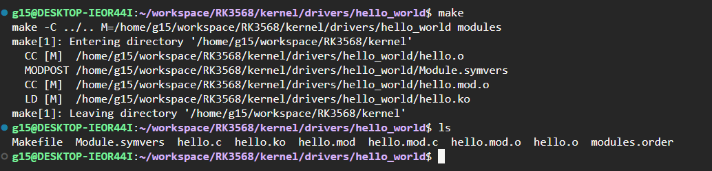
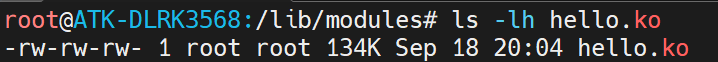
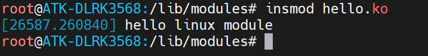
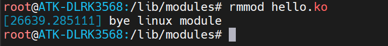
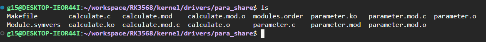

本章节主要围绕对于内核模块进行编译，部署，并运行的全流程。

根据正点原子的教程，编写了两个测试模块

* hello_world: 单独无依赖模块
* para_share:   分为两个模块，calculate模块依赖param模块运行，测试模块依赖特性

## hello_world 模块编译部署运行

对于常见的内核模块编写流程首先需要了解linux内核各类模块在linux内核源码中的位置（本项目以RK3568 正点原子的linux5.10环境为基础） 

```Shell
../kernel/drivers
```

创建自己的模块对应的文件夹，以及 .c 和 Makefile 编译文件

```Shell
mkdir hello_world # 创建驱动文件夹
touch hello.c     # 创建驱动源代码
touch Makefile    # 创建Makefile编译程序
```

最终得到了如下图的文件树


代码我已经按照正点原子的教程编写完成，现在开始分析代码

```C
#include <linux/module.h>  // linux 内核模块头文件
#include <linux/init.h>    // linux 内核初始化头文件
#include <linux/kernel.h>  // linux 内核头文件

// 一些面试八股文要点: static 关键字在代码中的作用
// 在函数前声明static：仅仅只能在本文件调用，无法被外部调用
// 在局部变量前声明: 同样不可被外部调用，同时初始化默认为0, 并且生命周期为程序声明周期
// 对于static的使用如果某个函数内声明了static的变量，如果多方调度，需要解决static声明的变量的单例性


// __init 关键字表示将该函数放到可执行文件的__init节区中，
// 该节区的内容只能用于模块的初始化阶段， 初始化阶段执行完毕之后，这部分的内容就会被释放掉
static int __init hello_linux_module(void)
{
    printk("hello linux module \r\n"); // 内核打印函数 
    return 0;
}

// __exit 关键字即代表卸载模块
// 需要注意的点是 在实际编写过程中需要释放初始化阶段分配的内存，分配的设备号
static void __exit bye_linux_module(void)
{
    printk("bye linux module \r\n");
}

//宏定义module_init用于通知内核初始化模块的时候， 
//要使用哪个函数进行初始化。它会将函数地址加入到相应的节区section中
//这样的话，开机的时候就可以自动加载模块了
module_init(hello_linux_module);
module_exit(bye_linux_module);

// 可以加上一些模块的个人声明，开源类型，可有可无
MODULE_AUTHOR("personal <1336980468@qq.com>");
MODULE_DESCRIPTION("hello module test");
MODULE_LICENSE("GPL");
```

对于Makefile的编写

```CMake
# 内核路径（需要根据自己开发环境进行调整）
# 我的路径 /home/g15/workspace/RK3568/kernel/drivers/hello_world
KERNEL_DIR = ../..

#目标架构
ARCH = arm64

# 指定交叉编译工具链
CROSS_COMPILE = aarch64-linux-gnu-

#导出环境变量
export ARCH CROSS_COMPILE

#指定要编译的内核模块
obj-m += hello.o

#编译驱动模块
all:
	$(MAKE) -C $(KERNEL_DIR) M=$(CURDIR) modules

# .PHONY 可作为make可选项，也就是可以通过 make clean的方式跳转到对应的执行命令
.PHONY: clean 

# 清理编译生成的文件
clean:
	$(MAKE) -C $(KERNEL_DIR) M=$(CURDIR) clean
```

编写完成 Makefile 和 hello.c 即可使用对应的交叉编译工具实现模块的单独编译 （注： 需要使用与目标核心板架构一致的交叉编译工具链）



最后编译产生hello.ko 以及附属产物，使用adb工具将编译后的内核模块上传到板卡

```Shell
adb push hello.ko /lib/modules
```

上传成功后结果可以显示，并注意在使用adb或者是scp拷贝文件到linux板卡的时候，最好使用sync同步命令，将写入的数据从缓存强制写入到内存中，否则掉电重启会概率性掉数据。（实习血与泪的教训 QAQ）



执行加载内核模块

```Shell
insmod hello.ko
```

结果正确显示了预期的打印内容



执行卸载内核模块

```Shell
rmmod hello.ko
```

同样结果显示预期的退出打印内容



## 讲讲printk和加载内核模块的指令

### printk

对于printk函数，可能会有人好奇为什么不使用printf，首先需要搞清楚一个前后逻辑关系，printf的底层glibc实现的打印函数，属于stdio.h的标准库，属于应用层级，依赖于内核，而我们现在所针对的对象是linux内核，因此不能反过来去引用应用层级的库函数。所以有了printk函数用于linux内核开发的调试手段和信息打印。而针对于内核的打印需要分为几个级别

* #define KERN_EMERG “<0>” 通常是系统崩溃前的信息
* #define KERN_ALERT “<1>” 需要立即处理的消息
* #define KERN_CRIT “<2>” 严重情况
* #define KERN_ERR “<3>” 错误情况
* #define KERN_WARNING “<4>” 有问题的情况
* #define KERN_NOTICE “<5>” 注意信息
* #define KERN_INFO “<6>” 普通消息
* #define KERN_DEBUG “<7>” 调试信息

如果我们希望查看当前内核的打印等级

```Shell
cat /proc/sys/kernel/printk
```

如果想要修改内核打印的等级

```Shell
#修改内核打印等级
sudo sh -c "echo 7 4 1 7 > /proc/sys/kernel/printk"
```

```text
7    4    1    7
│  │  │  │
│  │  │  └─ 默认控制台日志级别（default_console_loglevel）
│  │  └──── 控制台最小日志级别（minimum_console_loglevel）
│  └─────── 默认消息日志级别（default_message_loglevel）
└────────── 当前控制台日志级别（console_loglevel）
```

### 内核模块相关命令

1. 查看内核模块加载列表

```Shell
lsmod
```

2. 卸载内核模块

```Shell
rmmod <模块名称>.ko
```

3. 查看模块声明信息

```Shell
modinfo <模块名称>.ko
```

4. 按照依赖关系加载/卸载内核模块

```Shell
modprobe <模块名称> # 不加.ko
modprobe -r <模块名称>  # 卸载模块
```

5. 创建模块依赖关系

```Shell
depmod -a
```

创建后会产生一下依赖文件

| 配置文件或文件夹    | 作用                                       |
| ------------------- | ------------------------------------------ |
| build               | 指向当前正在运行的内核源代码的符号链接     |
| kernel              | 包含编译后的内核模块文件（.ko）            |
| modules.alias       | 定义模块别名的文件                         |
| modules.alias.bin   | 模块别名文件的二进制缓存版本               |
| modules.builtin     | 列出了由内核构建的模块（静态连接在内核中） |
| modules.builtin.bin | 由内核构建的模块列表的二进制缓存版本       |
| modules.dep         | 列出了模块之间的依赖关系                   |
| modules.dep.bin     | 模块依赖关系文件的二进制缓存版本           |
| modules.devname     | 包含了每个模块设备的名称                   |
| modules.order       | 定义模块加载顺序的文件                     |
| modules.symbols     | 保存导出的符号信息                         |
| modules.symbols.bin | 导出的符号信息的二进制缓存版本             |
| modules.softdep     | 包含模块软依赖关系的文件                   |

## para_share 模块编译部署运行

具体的创建和编译部署的流程实际和hello_world 模块的流程其实差不多，只不过多了一个依赖文件，在此内核模块的文件夹下的两个原文件分别为 parameter.c 和calculate.c 后者依赖前者声明的函数和变量。以下是parameter.c 源代码

```C
#include <linux/kernel.h>
#include <linux/init.h>
#include <linux/module.h>

/* int 类型描述 */
int itype = 0;
module_param(itype, int, S_IWUSR | S_IRUSR); // 用户可读写权限
MODULE_PARM_DESC(itype, "int type"); // 模块描述

static bool btype = false;
module_param(btype, bool, S_IWUSR | S_IRUSR);
MODULE_PARM_DESC(btype, "bool type");

static char ctype = 0;
module_param(ctype, byte, S_IWUSR | S_IRUSR);
MODULE_PARM_DESC(ctype, "char type");

static char *cptype = 0;
module_param(cptype, charp, S_IWUSR | S_IRUSR);
MODULE_PARM_DESC(cptype, "char* type");

static int arr[3] = { 0, 1, 2 };
module_param_array(arr, int, NULL, S_IWUSR | S_IRUSR);
MODULE_PARM_DESC(arr, "array type");

/* 模块初始化 */
int __init para_init(void)
{
	pr_info(KERN_INFO "parameter init!\n");
	pr_info(KERN_INFO "itype=%d\n", itype);
	pr_info(KERN_INFO "btype=%d\n", btype);
	pr_info(KERN_INFO "ctype=%d\n", ctype);
	pr_info(KERN_INFO "stype=%s\n", cptype);
	pr_info("*iarr* parameter: %d, %d, %d\n", arr[0], arr[1], arr[2]);
	return 0;
}

/* 模块退出*/
void __exit para_exit(void)
{
    printk(KERN_INFO"para exit \r\n");
}

/* 导出int类型的变量标识 */
EXPORT_SYMBOL(itype);

int my_add (int a, int b)
{
    return a + b;
}
EXPORT_SYMBOL(my_add); // 导出加法函数

int my_sub (int a, int b)
{
    return a - b;
}
EXPORT_SYMBOL(my_sub); // 导出减法函数

module_init(para_init); // 模块初始化
module_exit(para_exit); // 模块退出

MODULE_AUTHOR("personal <1336980468@qq.com>"); // 作者
MODULE_DESCRIPTION("hello module test add / sub / type"); // 模块总体描述
MODULE_LICENSE("GPL");  // 开源协议
```

以下是calculate.c 源代码

```C
#include <linux/kernel.h>
#include <linux/init.h>
#include <linux/module.h>

/* 外部依赖 依赖其他文件实现符号 */
extern int itype;
int my_add(int a,int b);
int my_sub(int a, int b);

/* 依旧初始化 */
static int __init calculate_init(void)
{
    printk(KERN_INFO"hello calculate module \r\n");
    printk(KERN_INFO"test itype: %d, add: %d ,sub: %d \r\n",
           itype, my_add(itype, 1), my_sub(itype, 1));
    return 0;
}

/* 依旧退出函数 值得未来开发注意的点退出模块需要释放申请的所有资源*/
static void __exit calculate_exit(void)
{
    printk(KERN_INFO"cal module exit \r\n");
}

module_init(calculate_init);
module_exit(calculate_exit);

MODULE_AUTHOR("personal <1336980468@qq.com>"); // 作者
MODULE_DESCRIPTION("hello module test calculate"); // 模块总体描述
MODULE_LICENSE("GPL");  // 开源协议
```

对于Makefile文件也有比较小的改动，也就是增加了两个需要编译的文件选项，将calculate.c 和 parameter.c 分别编译成独立的 .ko 文件

```CMake
# 回到kernel 根目录
KERNEL_DIR = ../..
# 目标芯片架构
ARCH = arm64
# 目标编译器
CROSS_COMPILE = aarch64-linux-gnu-
# 导出环境变量 
export ARCH CROSS_COMPILE  

# 需要编译的模块
obj-m += calculate.o parameter.o

# 编译指令含义 $(MAKE) make编译 -C 指定内核源码目录  M=$(..) 模块源码目录 modules 按照模块编译
all:
	$(MAKE) -C $(KERNEL_DIR) M=$(CURDIR) modules

.PHONY: clean
# 清理编译后生成的文件
clean:
	$(MAKE) -C $(KERNEL_DIR) M=$(CURDIR) clean
```

最后进行编译，会出现更多的产物包括 parameter.ko 和 calculate.ko



最后部署到开发板，并执行，有两种执行方式，一种是按照依赖顺序insmod，还有一种就是直接modprobe直接按依赖自动加载

而使用insmod可以手动加载传入参数

```Shell
#加载parameter内核模块并传参
sudo insmod parameter.ko itype=123 btype=1 ctype=200 cptype=abc

#信息输出如下
[11345.419275] parameter init!
[11345.419378] itype=123
[11345.419390] btype=1
[11345.419399] ctype=200
[11345.419410] stype=abc
[11345.419420] *iarr* parameter: 0, 1, 2

#加载calculation内核模块
sudo insmod calculation.ko

#信息输出如下
[12013.851366] hello calculate module
[12013.851496] test itype: 123, add: 124 ,sub: 122
```

同样我们可以用上一节的内核模块的指令depmod去建立两个依赖模块的依赖关系

```Shell
root@ATK-DLRK3568:/lib/modules# ls
5.10.160   bcmdhd_pcie.ko  parameter.ko  RTL8189FU.ko
8852be.ko  calculate.ko    rtk_btusb.ko  RTL8723DS.ko
8852bs.ko  hci_uart.ko     rtkm.ko       RTL8821CS.ko
bcmdhd.ko  hello.ko        RTL8189FS.ko  RTL8822CS.ko
root@ATK-DLRK3568:/lib/modules# cp parameter.ko 5.10.160/
root@ATK-DLRK3568:/lib/modules# cp calculate.ko 5.10.160/
root@ATK-DLRK3568:/lib/modules# cd 5.10.160/
root@ATK-DLRK3568:/lib/modules/5.10.160# depmod -a
depmod: WARNING: could not open modules.order at /lib/modules/5.10.160: No such file or directory
depmod: WARNING: could not open modules.builtin at /lib/modules/5.10.160: No such file or directory
root@ATK-DLRK3568:/lib/modules/5.10.160# ls
calculate.ko               modules.builtin.bin  modules.softdep
modules.alias              modules.dep          modules.symbols
modules.alias.bin          modules.dep.bin      modules.symbols.bin
modules.builtin.alias.bin  modules.devname      parameter.ko
root@ATK-DLRK3568:/lib/modules/5.10.160# cat modules.dep | grep calculate
calculate.ko: parameter.ko
```

最终输出发现 calculate.ko 是依赖于 parameter.ko 模块

同样我们可以使用modprobe的方案自动加载模块

```Shell
root@ATK-DLRK3568:/lib/modules/5.10.160# modprobe calculate
[29195.326303] parameter init!
[29195.326384] itype=520
[29195.326392] btype=1
[29195.326400] ctype=200
[29195.326406] stype=abc
[29195.326413] *iarr* parameter: 0, 1, 2
[29195.328289] hello calculate module
[29195.328387] test itype: 520, add: 521 ,sub: 519
root@ATK-DLRK3568:/lib/modules/5.10.160# lsmod
Module                  Size  Used by
calculate              16384  0
parameter              16384  1 calculate
hci_uart               45056  1
8852bs               3858432  0
```

我们可以使用modprobe加上-r的命令行参数，卸载对应的模块以及依赖模块

```Shell
root@ATK-DLRK3568:/lib/modules/5.10.160# modprobe -r calculate
[29310.225213] cal module exit
[29310.247515] para exit
```

如果需要使用modprobe加载时传入parameter的参数，可参考以下方式(如果是4.19版本参考正点原子的方案)， 由于烧录的系统为精简busybox，因此本身启动项不带有modprobe.d的相关文件：

1. 在 /etc 的目录下创建modprobe.d 文件夹

```Shell
sudo mkdir -p /etc/modprobe.d
```

2. 在modprobe.d 文件夹下创建对应于模块名称的.conf文件

```Shell
touch parameter.conf
echo "options parameter itype=123 btype=1 ctype=200 stype=abc" > parameter.conf
```

执行完这两步操作，即可实现使用modprobe 载入模块的时候带上conf的参数

对于模块自启动的方案，无法使用正点原子创建modprobe-load.d的方式执行，由于busybox不带有system.d, 因此可以使用常见的在init.d 当中创建启动脚本

例如S99insmod.sh 并加权限，也可以实现对应的模块自启动载入的功能

```Shell
cd /etc/init.d  # 进入自启动文件夹
touch S99insmod.sh # 创建自启动文件
echo -e "cd /etc/modules/5.10.160\nmodprobe calculate" > S99insmod.sh # 写入自启动运行命令
chmod +x S99insmod # 给自启动脚本加权
```

最后reboot进行验证

```Shell
[    8.853755] Bluetooth: h5_open
Realtek Bluetooth :Realtek Bluetooth post process
[    8.853789] Bluetooth: hci_uart_register_dev
Realtek Bluetooth :Device setup complete
[    8.854156] rtk_btcoex: Open BTCOEX
[    8.856060] rtk_btcoex: BTCOEX hci_rev 0xddb7
[    8.856087] rtk_btcoex: BTCOEX lmp_subver 0x43b1

root@ATK-DLRK3568:/#
root@ATK-DLRK3568:/#
root@ATK-DLRK3568:/#
root@ATK-DLRK3568:/# [21:07:59.591] Detected a monitor change on head 'DSI-1', not bothering to do
lsmod
Module                  Size  Used by
calculate              16384  0
parameter              16384  1 calculate
hci_uart               45056  1
8852bs               3858432  0
```
