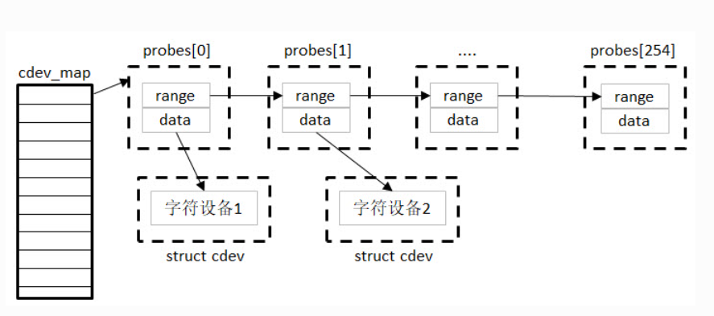
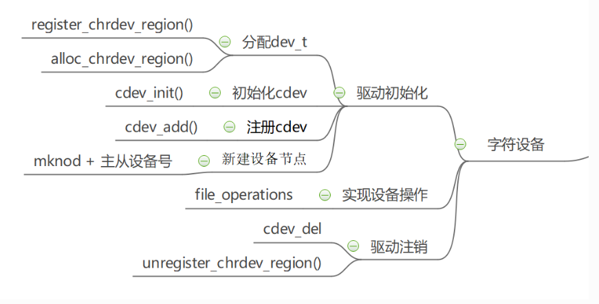
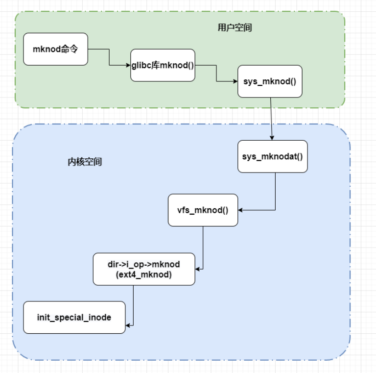
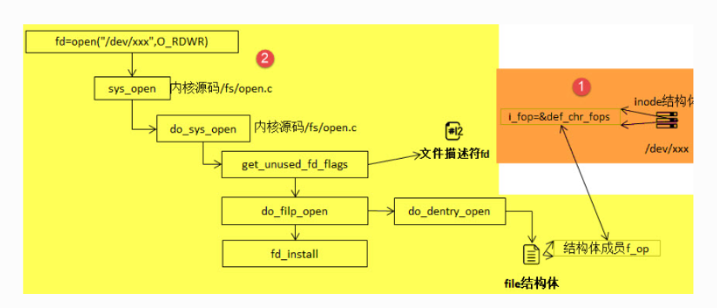
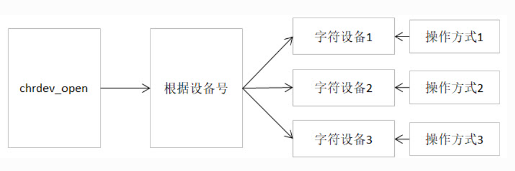

## Linux设备分类

首先我们需要了解一下Linux的设备分为字符设备，块设备，网络设备

* 字符设备: 按字节字符读写设备，通常是数据流式，大多不需要使用缓存器，比如键盘
* 块设备: 支持随机存取和寻址，需要用到缓存器。操作系统会分配缓存，然后缓存满了就会被传走。比如硬盘，SD卡
* 网络设备: 通常使用Socket Api与内核网络协议栈进行交互，比如以太网卡，无线网卡，本地回环

linux设备系统抽象为

```C
struct cdev
struct block_device
struct net_devce
```

## 字符设备抽象

Linux内核中将字符设备抽象成一个具体的数据结构(struct cdev)

cdev记录了字符设备的相关信息(设备号、内核对象)，字符设备的打开、读写、关闭等操作接口(file_operations)

* 硬件层: 就相当于裸机开发，也就是对照着数据手册编写通信逻辑，配置寄存器，读写操作放在文件操作的接口里。
* 驱动层: 将文件操作接口注册到内核，内核通过散列表登记记录主次设备号
* 文件系统层: 新建文件的方式绑定文件操作接口，程序通过操作指定文件的文件操作接口设置底层寄存器

## 相关概念及其数据结构

对于每个设备，在linux当中，使用设备编号来表示设备，使用主设备号区分类别，次设备号区分具体设备。

在linux的根目录下 /dev 文件夹专门用来存放设备的驱动文件。可以使用 ls -l查看该目录下所设备的设备类型以及主从设备号

```Shell
root@ATK-DLRK3568:/# cd dev/
root@ATK-DLRK3568:/dev# ls -l
total 8.0K
drwxr-xr-x 3 root root         480 Sep 19 18:32 block
drwxr-xr-x 3 root root          60 Jan  1  1970 bus
crw-rw---- 1 root video   248,   0 Sep 19 18:32 cec0
drwxr-xr-x 2 root root        3.6K Sep 19 18:32 char
crw------- 1 root root      5,   1 Sep 19 18:32 console
crw------- 1 root root     10, 121 Sep 19 18:32 cpu_dma_latency
crw-rw-rw- 1 root root     10, 123 Sep 19 18:32 crypto
drwxr-xr-x 8 root root         160 Sep 19 18:32 disk
drwxr-xr-x 2 root root         160 Jan  1  1970 dma_heap
drwxr-xr-x 3 root root         140 Sep 19 18:32 dri
crw-rw---- 1 root video    29,   0 Sep 19 18:32 fb0
lrwxrwxrwx 1 root root          13 Sep 19 18:31 fd -> /proc/self/fd
crw-rw-rw- 1 root root      1,   7 Sep 19 18:32 full
crw-rw-rw- 1 root root     10, 229 Sep 19 18:32 fuse
crw------- 1 root root    254,   0 Sep 19 18:32 gpiochip0
crw------- 1 root root    254,   1 Sep 19 18:32 gpiochip1
crw------- 1 root root    254,   2 Sep 19 18:32 gpiochip2
crw------- 1 root root    254,   3 Sep 19 18:32 gpiochip3
crw------- 1 root root    254,   4 Sep 19 18:32 gpiochip4
crw------- 1 root root    254,   5 Sep 19 18:32 gpiochip5
crw------- 1 root root     10, 122 Sep 19 18:32 gyrosensor
crw-rw-rw- 1 root root     10, 116 Sep 19 18:32 hdmi_hdcp1x
```

设备标识

* c : 字符设备
* b : 标识块设备

例如

```Shell
crw------- 1 root root    254,   2 Sep 19 18:32 gpiochip2
```

表示GPIO是属于为字符设备， 主设备号254， 从设备号为2

在Linux内核当中使用dev_t 表示设备编号，其变量类型为uint32类型，低20位表示次设备号，高12位表示主设备号

```C
typedef u32 __kernel_dev_t;
typedef __kernel_dev_t               dev_t;
```

设备号使用掩码移位的形式产生

```C
#define MINORBITS    20 // 定义低20位
#define MINORMASK    ((1U << MINORBITS) - 1) // 低20位有效掩码

#define MAJOR(dev)   ((unsigned int) ((dev) >> MINORBITS)) // 主设备号只要右移 20 位就可以得到
#define MINOR(dev)   ((unsigned int) ((dev) & MINORMASK))  // 次设备号与掩码取与得到
#define MKDEV(ma,mi) (((ma) << MINORBITS) | (mi)) // 主从设备号合并为 dev_t 类型
```

在内核当中使用的是cdev_map 维护所有的cdev字符设备，其底层逻辑是使用哈希表进行存储，哈希值使用主序列号进行生成

```C
f(major)=major%255
```

如果出现了哈希冲突，也就是出现了多个相同的主设备，使用链表的形式，以次设备号排序链接



cdev的结构体如下

```C
struct cdev {
   struct kobject kobj; // 内嵌内核对象
   struct module *owner;// 字符设备驱动对应的内核模块对象指针
   const struct file_operations *ops; // 文件操作 外部open/read/close 等操作
   struct list_head list; // 链表结构体
   dev_t dev; // 设备号
   unsigned int count; // 同一主设备号下的次设备号
} __randomize_layout;
```

对于linux的设备节点，通过mknod指令进行创建。对于linux系统来说，万物皆文件

### file_operations 结构体

简单来说file_operations 结构体的作用是将系统调用和驱动程序关联的数据结构，也就是将所有的操作标准化，调用这个函数，就会执行函数指针指向的函数。而对于不支持的操作，需要将函数指针指向NULL

```C
struct file_operations {
	struct module *owner;
	loff_t (*llseek) (struct file *, loff_t, int);
	ssize_t (*read) (struct file *, char __user *, size_t, loff_t *);
	ssize_t (*write) (struct file *, const char __user *, size_t, loff_t *);
	ssize_t (*read_iter) (struct kiocb *, struct iov_iter *);
	ssize_t (*write_iter) (struct kiocb *, struct iov_iter *);
	int (*iopoll)(struct kiocb *kiocb, bool spin);
	int (*iterate) (struct file *, struct dir_context *);
	int (*iterate_shared) (struct file *, struct dir_context *);
	__poll_t (*poll) (struct file *, struct poll_table_struct *);
	long (*unlocked_ioctl) (struct file *, unsigned int, unsigned long);
	long (*compat_ioctl) (struct file *, unsigned int, unsigned long);
	int (*mmap) (struct file *, struct vm_area_struct *);
	unsigned long mmap_supported_flags;
	int (*open) (struct inode *, struct file *);
	int (*flush) (struct file *, fl_owner_t id);
	int (*release) (struct inode *, struct file *);
	int (*fsync) (struct file *, loff_t, loff_t, int datasync);
	int (*fasync) (int, struct file *, int);
	int (*lock) (struct file *, int, struct file_lock *);
	ssize_t (*sendpage) (struct file *, struct page *, int, size_t, loff_t *, int);
	unsigned long (*get_unmapped_area)(struct file *, unsigned long, unsigned long, unsigned long, unsigned long);
	int (*check_flags)(int);
	int (*flock) (struct file *, int, struct file_lock *);
	ssize_t (*splice_write)(struct pipe_inode_info *, struct file *, loff_t *, size_t, unsigned int);
	ssize_t (*splice_read)(struct file *, loff_t *, struct pipe_inode_info *, size_t, unsigned int);
	int (*setlease)(struct file *, long, struct file_lock **, void **);
	long (*fallocate)(struct file *file, int mode, loff_t offset,
			  loff_t len);
	void (*show_fdinfo)(struct seq_file *m, struct file *f);
#ifndef CONFIG_MMU
	unsigned (*mmap_capabilities)(struct file *);
#endif
	ssize_t (*copy_file_range)(struct file *, loff_t, struct file *,
			loff_t, size_t, unsigned int);
	loff_t (*remap_file_range)(struct file *file_in, loff_t pos_in,
				   struct file *file_out, loff_t pos_out,
				   loff_t len, unsigned int remap_flags);
	int (*fadvise)(struct file *, loff_t, loff_t, int);

	ANDROID_KABI_RESERVE(1);
	ANDROID_KABI_RESERVE(2);
	ANDROID_KABI_RESERVE(3);
	ANDROID_KABI_RESERVE(4);
} __randomize_layout;
```

对于部分函数的解读 (拷贝一下正点原子的解释)

* **llseek：** 用于修改文件的当前读写位置，并返回偏移后的位置。参数file传入了对应的文件指针，我们可以看到以上代码中所有的函数都有该形参，通常用于读取文件的信息，如文件类型、读写权限；参数loff_t指定偏移量的大小；参数int是用于指定新位置指定成从文件的某个位置进行偏移，SEEK_SET表示从文件起始处开始偏移；SEEK_CUR表示从当前位置开始偏移；SEEK_END表示从文件结尾开始偏移。
* **read：** 用于读取设备中的数据，并返回成功读取的字节数。该函数指针被设置为NULL时，会导致系统调用read函数报错，提示“非法参数”。该函数有三个参数：file类型指针变量，char__user*类型的数据缓冲区，__user用于修饰变量，表明该变量所在的地址空间是用户空间的。内核模块不能直接使用该数据，需要使用copy_to_user函数来进行操作。size_t类型变量指定读取的数据大小。
* **write：** 用于向设备写入数据，并返回成功写入的字节数，write函数的参数用法与read函数类似，不过在访问__user修饰的数据缓冲区，需要使用copy_from_user函数。
* **unlocked_ioctl：** 提供设备执行相关控制命令的实现方法，它对应于应用程序的fcntl函数以及ioctl函数。在 kernel 3.0 中已经完全删除了 struct file_operations 中的 ioctl 函数指针。
* **open：** 设备驱动第一个被执行的函数，一般用于硬件的初始化。如果该成员被设置为NULL，则表示这个设备的打开操作永远成功。
* **release：** 当file结构体被释放时，将会调用该函数。与open函数相反，该函数可以用于释放

仍然需要强调，对于读写操作在用户态的空间时，需要使用copy_to_user函数以及copy_from_user函数来进行数据访问，写入/读取成 功函数返回0，失败则会返回未被拷贝的字节数。

```C
static inline long copy_from_user(void *to, const void __user * from, unsigned long n)
static inline long copy_to_user(void __user *to, const void *from, unsigned long n)
```

参数:

* **to** ：指定目标地址，也就是数据存放的地址，
* **from** ：指定源地址，也就是数据的来源。
* **n** ：指定写入/读取数据的字节数。

返回值:

* 写入 / 读取数据的字节数

### file结构体

内核中使用file结构体来表示每个被打开的文件，也就是在打开一个文件，内核创建一个结构体，将对改文件操作的函数传递给 f_op 成员变量，当文件被关闭，则释放结构体所占资源

```C
struct file {
{......}
const struct file_operations *f_op;
/* needed for tty driver, and maybe others */
void *private_data;
{......}
};
```

* **f_op** ：存放与文件操作相关的一系列函数指针，如open、read、wirte等函数。
* **private_data** ：该指针变量只会用于设备驱动程序中，内核并不会对该成员进行操作。因此，在驱动程序中，通常用于指向描述设备的结构体

### inode结构体

简单来说inode实际上表示的是一个文件本身的所有属性，包括文件类型，权限，文件大小，时间信息等，打开多个此文件，都可以指向inode，因为inode描述共同的共享本体信息

```C
struct inode {

   dev_t    i_rdev;
   {......}
   union {
      struct pipe_inode_info *i_pipe;   /* linux内核管道 */
      struct block_device *i_bdev;      /* 如果这是块设备，则设置并使用 */
      struct cdev *i_cdev;              /* 如果这是字符设备，则设置并使用 */
      char        *i_link;
      unsigned    i_dir_seq;
   };
   {......}
};
```

* **dev_t i_rdev：** 表示设备文件的结点，这个域实际上包含了设备号。
* *struct cdev *i_cdev：** struct cdev是内核的一个内部结构，它是用来表示字符设备的，当inode结点指向一个字符设备文件时，此域为一个指向inode结构的指针。

## 字符设备框架

借用正点原子的框架图展示



当我们需要创建一个字符设备，首先我们需要得到一个设备号，分配设备号包括静态分配和动态分配。当拿到设备的唯一ID，就需要实现file_operation对应的函数并保存的cdev当中，实现cdev的初始化。之后我们将所做额度工作告诉内核，使用cdev_add()注册cdev，最后创建设备节点

在注销时要释放 cdev 归还申请的设备号，删除创建的设备节点。

1. 字符设备的定义方式

* 静态定义

```C
static struct cdev chrdev;
```

* 动态定义 (动态分配内存的方式)

```C
struct cdev *cdev_alloc(void)
```

2. 移除某个字符设备

```C
void cdev_del(struct cdev *p)
```

3. 静态的为一个字符设备申请一个或者多个设备编号

```C
int register_chrdev_region(dev_t from, unsigned count, const char *name)
```

* **from** ：dev_t类型的变量，用于指定字符设备的起始设备号，如果要注册的设备号已经被其他的设备注册了，那么就会导致注册失败。
* **count** ：指定要申请的设备号个数，count的值不可以太大，否则会与下一个主设备号重叠。
* **name** ：用于指定该设备的名称，我们可以在/proc/devices中看到该设备

4. 动态分配设备编号

```C
int alloc_chrdev_region(dev_t *dev, unsigned baseminor, unsigned count, const char *name)
```

* **dev** ：指向dev_t类型数据的指针变量，用于存放分配到的设备编号的起始值；
* **baseminor** ：次设备号的起始值，通常情况下，设置为0；
* **count、name** ：同register_chrdev_region类型，用于指定需要分配的设备编号的个数以及设备的名称。

5. 将分配的设备编号交还给内核

```C
void unregister_chrdev_region(dev_t from, unsigned count)
```

* **from** ：指定需要注销的字符设备的设备编号起始值，我们一般将定义的dev_t变量作为实参。
* **count** ：指定需要注销的字符设备编号的个数，该值应与申请函数的count值相等，通常采用宏定义进行管理。

6. 支持静态申请设备号，动态申请设备号，主设备号返回

```C
static inline int register_chrdev(unsigned int major, const char *name,
const struct file_operations *fops)
{
   return __register_chrdev(major, 0, 256, name, fops);
}
```

* **major** ：用于指定要申请的字符设备的主设备号，等价于register_chrdev_region函数，当设置为0时，内核会自动分配一个未使用的主设备号。
* **name** ：用于指定字符设备的名称
* **fops** ：用于操作该设备的函数接口指针。

7. 注销由register_chrdev 注册的设备号

```C
static inline void unregister_chrdev(unsigned int major, const char *name)
{
__unregister_chrdev(major, 0, 256, name);
}
```

* **major** ：指定需要释放的字符设备的主设备号，一般使用register_chrdev函数的返回值作为实参。
* **name** ：执行需要释放的字符设备的名称。

8. 初始化cdev

```C
void cdev_init(struct cdev *cdev, const struct file_operations *fops)
```

* **cdev** ：struct cdev类型的指针变量，指向需要关联的字符设备结构体；
* **fops** ：file_operations类型的结构体指针变量，一般将实现操作该设备的结构体file_operations结构体作为实参。

9. 向内核cdev_map 哈希表新增一个字符设备

```C
int cdev_add(struct cdev *p, dev_t dev, unsigned count)
```

* **p** ：struct cdev类型的指针，用于指定需要添加的字符设备；
* **dev** ：dev_t类型变量，用于指定设备的起始编号；
* **count** ：指定注册多少个设备。

10. 从系统中删除字符设备

```C
void cdev_del(struct cdev *p)
```

* **p** ：struct cdev类型的指针，用于指定需要删除的字符设备；

11. 创建设备并注册到文件系统

```C
struct device *device_create(struct class *class, struct device *parent,
            dev_t devt, void *drvdata, const char *fmt, ...)
```

* **class** ：指向这个设备应该注册到的struct类的指针；
* **parent** ：指向此新设备的父结构设备(如果有)的指针；
* **devt** ：要添加的char设备的开发；
* **drvdata** ：要添加到设备进行回调的数据；
* **fmt** ：输入设备名称。

12. 删除使用device_create函数创建的设备

```C
void device_destroy(struct class *class, dev_t devt)
```

* **class** ：指向注册此设备的struct类的指针；
* **devt** ：以前注册的设备的开发；

## 有关于节点创建

通常可以使用mknod的方式创建设备节点

```Shell
mknode <设备名> <设备类型> <主设备号> <次设备号>
```

设备类型:

* b 创建(有缓冲的)区块特殊文件
* c, u 创建(没有缓冲的)字符特殊文件
* p 创建先进先出(FIFO)特殊文件

例子:

```Shell
mknode /dev/test c 2 0
```

创建一个字符设备/dev/test，其主设备号为2，次设备号为0

当调用mknode创建设备节点其调用逻辑链条如下图



对应内核源码为

```C
static struct inode *shmem_get_inode(struct super_block *sb, const struct inode *dir,
umode_t mode, dev_t dev, unsigned long flags)
{
   inode = new_inode(sb);
   if (inode) {
      ......
      switch (mode & S_IFMT) {
         default:
         inode->i_op = &shmem_special_inode_operations;
         init_special_inode(inode, mode, dev);
         break;
         ......
      }
   } else
   shmem_free_inode(sb);
   return inode;
}
```

```C
void init_special_inode(struct inode *inode, umode_t mode, dev_t rdev)
{
   inode->i_mode = mode;
   if (S_ISCHR(mode)) {
      inode->i_fop = &def_chr_fops;
      inode->i_rdev = rdev;
   } else if (S_ISBLK(mode)) {
      inode->i_fop = &def_blk_fops;
      inode->i_rdev = rdev;
   } else if (S_ISFIFO(mode))
      inode->i_fop = &pipefifo_fops;
   else if (S_ISSOCK(mode))
      ;      /* leave it no_open_fops */
   else
      printk(KERN_DEBUG "init_special_inode: bogus i_mode (%o) for"
            " inode %s:%lu\n", mode, inode->i_sb->s_id,
            inode->i_ino);
}
```

对于inode的file_opration并非自行构造了file_operation, 而是绑定了通用的def_chr_fops, 也就是默认的文件操作函数

## open函数的底层逻辑

通常我们在应用层代码中需要启用某个设备的时候，我们会使用open函数去打开这个设备文件，去进行初始化，并申请一些资源，当打开成功之后会获得设备的文件描述符，通过这个设备描述符，我们就可以对设备进行write / read的读写操作。以下是open函数的调用逻辑链



1. 首先虚拟文件系统VFS会查找到对应字符设备的inode节点
2. 遍历字符设备哈希表，根据inode节点的字符设备的设备号找到cdev对象
3. 创建file对象（系统采用一个数组管理进程中多个被打开的设备，每个文件描述符作为数组的下标标识设备对象）
4. 初始化file对象，将file对象的file_operations 成员指向字符设备对象的file_operations 成员
5. 回调 file->fops->open函数

在经过一系列的调用，从解析文件路径，查找inode文件节点，来到do_dentry_open 初始化内核函数

```C
static int do_dentry_open(struct file *f,struct inode *inode,int (*open)(struct inode *, struct file *),const struct cred *cred)
{
   //……
   f->f_op = fops_get(inode->i_fop); // 获取inode记录的文件file_operation
   //……
   if (!open) // 如果open函数指针为空
   open = f->f_op->open; // 将文件结构体的f_op对应open函数指针赋值给open
   // 判断open函数指针是否不为空 
   if (open) {
      // 打卡inode对应的文件 
      error = open(inode, f);
      if (error)
      goto cleanup_all;
   }
   //……
}
```

对于def_chr_fops结构体

```C
const struct file_operations def_chr_fops = {
   .open = chrdev_open,
   .llseek = noop_llseek,
};
```

最终，会执行def_chr_fops中的open函数，也就是chrdev_open函数，可以理解为一个字符设备的通用初始化函数，根据字符设备的设备号， 找到相应的字符设备，从而得到操作该设备的方法，代码实现如下。



PS(什么是自旋锁): 在多核或者并发的环境下，保证同一时刻只有一个执行流进入临界区访问共享资源

```C
static int chrdev_open(struct inode *inode, struct file *filp)
{
    // 用于临时保存最终找到的驱动 file_operations
    const struct file_operations *fops;

    // p 指向当前设备对应的 struct cdev
    struct cdev *p;

    // new 用于保存从 cdev_map 中新查找到的 cdev
    // 初始为空
    struct cdev *new = NULL;

    // 函数返回值，0 表示成功
    int ret = 0;


    // 获取字符设备全局自旋锁
    // 保护 inode->i_cdev、cdev 链表等共享数据
    spin_lock(&cdev_lock);


    // 查看当前 inode 是否已经缓存了对应的 cdev
    // 注意：i_cdev 是 struct cdev *，不是设备号
    p = inode->i_cdev;


    // 如果 inode 目前还没有关联到 cdev
    // 通常说明这是第一次通过这个 inode 打开该字符设备
    if (!p) {

        // kobject 指针，用于接收 kobj_lookup() 的查询结果
        struct kobject *kobj;

        // 保存当前设备号在 cdev 注册范围中的偏移
        int idx;


        // kobj_lookup() 内部可能执行较复杂的查找，
        // 因此先释放 cdev_lock，避免长时间持有自旋锁
        spin_unlock(&cdev_lock);


        // 根据 inode->i_rdev 中保存的设备号
        // 到 cdev_map 中查找注册这个设备号的字符设备
        //
        // inode->i_rdev：
        //      主设备号 + 次设备号
        //
        // cdev_map：
        //      设备号 -> cdev 的映射关系
        //
        // idx：
        //      当前设备号在该 cdev 管理范围内的偏移
        kobj = kobj_lookup(cdev_map, inode->i_rdev, &idx);


        // 如果没有找到对应的字符设备
        // 说明这个设备号没有有效的 cdev/驱动与之对应
        if (!kobj)
            return -ENXIO;


        // kobj 实际上是 struct cdev 内部的成员：
        //
        // struct cdev {
        //     struct kobject kobj;
        //     ...
        // };
        //
        // 通过 container_of() 根据 kobj 地址
        // 反推出完整的 struct cdev 地址
        new = container_of(kobj, struct cdev, kobj);


        // 再次获取 cdev_lock
        spin_lock(&cdev_lock);


        /*
         * 刚才释放锁进行 kobj_lookup() 的过程中，
         * 其他 CPU/线程可能已经完成了 inode->i_cdev 的绑定。
         *
         * 所以这里必须重新读取一次。
         */
        p = inode->i_cdev;


        // 如果仍然没有其他执行流为这个 inode 绑定 cdev
        if (!p) {

            // 把刚刚查找到的 cdev 缓存在 inode->i_cdev 中
            //
            // 同时：
            // p = new
            //
            // 因此以后再打开这个 inode 时，
            // 就可以直接通过 inode->i_cdev 找到 cdev，
            // 不需要重新查 cdev_map
            inode->i_cdev = p = new;


            // 把当前 inode 挂到该 cdev 的 inode 链表中
            //
            // 一个 cdev 可以对应多个 inode，
            // p->list 用于记录这些 inode
            list_add(&inode->i_devices, &p->list);


            // new 已经正式交给 inode 使用，
            // 后面不能再把 new 的引用释放掉
            // 所以将 new 清空
            new = NULL;


        // 如果发现别的执行流已经抢先绑定好了 inode->i_cdev
        //
        // 那么我们不再使用刚刚查找到的 new，
        // 而是使用现有的 p
        //
        // cdev_get(p) 获取/增加对该 cdev 的引用
        } else if (!cdev_get(p)) {

            // 如果 cdev 已经无效或引用获取失败
            ret = -ENXIO;
        }


    // 如果 inode->i_cdev 一开始就已经存在
    //
    // 说明这个 inode 以前已经找到过对应的 cdev，
    // 不需要再去 cdev_map 查询
    } else if (!cdev_get(p)) {

        // 尝试增加 cdev 引用失败
        ret = -ENXIO;
    }


    // inode->i_cdev / cdev 链表处理完毕
    // 释放自旋锁
    spin_unlock(&cdev_lock);


    // 如果 new 仍然非 NULL，
    // 说明刚才查到的 cdev 最终没有被使用
    //
    // 例如：
    // 在我们释放锁查表的时候，
    // 其他 CPU 已经抢先设置了 inode->i_cdev
    //
    // 此时释放刚刚 kobj_lookup() 获取的那个引用
    //
    // new == NULL 时相当于什么都不做
    cdev_put(new);


    // 如果前面获取 cdev 失败
    // 直接返回错误
    if (ret)
        return ret;


    // 先设置一个默认错误值
    // 后面任何步骤失败时可以返回 -ENXIO
    ret = -ENXIO;


    // p->ops 就是驱动在 cdev_init() 时绑定的
    // struct file_operations
    //
    // 例如：
    //
    // cdev_init(&dev->cdev, &my_fops);
    //
    // 那么：
    //
    // p->ops == &my_fops
    //
    // fops_get() 同时会保证该 fops 所属模块在使用期间不会被卸载
    fops = fops_get(p->ops);


    // 如果没有得到有效的 file_operations
    if (!fops)
        goto out_cdev_put;


    // 将当前 struct file 使用的操作函数集
    //
    // 从字符设备默认的 def_chr_fops
    //
    // 替换成真正驱动提供的 file_operations
    //
    // 即：
    //
    // filp->f_op
    //     ↓
    // driver_fops
    replace_fops(filp, fops);


    // 检查真正驱动是否实现了 open() 方法
    if (filp->f_op->open) {

        // 调用驱动自己的 open()
        //
        // 例如：
        //
        // static const struct file_operations my_fops = {
        //     .open = my_open,
        // };
        //
        // 此处最终就会调用：
        //
        // my_open(inode, filp);
        ret = filp->f_op->open(inode, filp);


        // 如果驱动 open() 返回错误
        // 则进入错误清理流程
        if (ret)
            goto out_cdev_put;
    }


    // 驱动 open 成功
    return 0;


out_cdev_put:

    // 打开失败，释放之前获取的 cdev 引用
    cdev_put(p);

    // 返回错误码
    return ret;
}
```

最后，调用上图的fd_install函数，完成文件描述符和文件结构体file的关联，之后我们使用对该文件描述符fd调用read、write函数， 最终都会调用file结构体对应的函数，实际上也就是调用cdev结构体中ops结构体内的相关函数

当我们使用open函数打开设备文件的时候，会根据设备文件的设备号找到对应的设备结构体，从而获得操作该设备的方法。如果需要添加一个设备，我们需要提供设备号，设备结构体，以及操作该设备的方法
