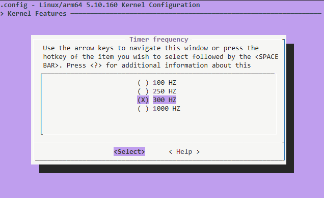
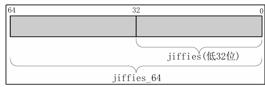

## 内核时间管理

与freeRTOS以及ucos操作系统一致，Linux在实际运行的时候也需要一个系统时钟，而时钟的最底层来源就是SOC的硬件定时器，通常会使用一个通用定时器。系统使用定时中断进行计时，比如 100HZ , 1000HZ就是系统的节拍率。而这个节拍率我们可以进行设置

```Shell
make ARCH=arm64 menuconfig // 在内核路径下执行打开配置界面
```



进入图形化配置界面即可选择系统的时间节拍，设置好后就是周期性的产生中断。比如如图所示300HZ的意思就是一秒钟产生300次中断

在linux内核中会使用CONFIG_HZ 设置自己的系统时钟

```C
# undef HZ 
# define HZ          CONFIG_HZ  
# define USER_HZ     100
```

这就有可能会产生疑问，为什么节拍率不设置的大一点呢

* 高节拍率可以提高时间精度，时间测量也会越准确
* 高节拍率会导致中断产生更加频繁，会增加系统的处理负担，中断服务函数占用处理器的时间也会增加

在linux内核中使用一个全局变量jiffies记录启动以来的系统节拍数

```C
extern u64 __cacheline_aligned_in_smp jiffies_64; 
extern unsigned long volatile __cacheline_aligned_in_smp 
__jiffy_arch_data jiffies;
```

jiffies_64 和 jiffies 其实是同一个东西，jiffies_64 用于 64 位系统，而 jiffies 用于 32位系统。为了兼容不同的硬件，jiffies 其实就是 jiffies_64 的低 32 位，jiffies_64和 jiffies 的结构如图



因此简单来说jiffies就是用来计数系统运行了多久的，既然如此因为jiffies具有数据长度，因此能记录的时间肯定有限，也就是产生溢出的风险，如果节拍率为1KHZ，32位的jiffies只需要49.7天就发生了绕回而对于64位的来说需要5.8亿年，可以忽略不计。因此需要对32位进行绕回的处理，在linux内核中使用了几个api进行处理。


| API函数                          | 描述                                                                                                  |
| ---------------------------------- | ------------------------------------------------------------------------------------------------------- |
| `time_after(unknown, known)`     | 判断`unknown` 是否在 `known` 之后。`unknown` 通常为当前的 `jiffies`，`known` 通常为需要比较的时间值。 |
| `time_before(unknown, known)`    | 判断`unknown` 是否在 `known` 之前。                                                                   |
| `time_after_eq(unknown, known)`  | 判断`unknown` 是否在 `known` 之后或等于 `known`。                                                     |
| `time_before_eq(unknown, known)` | 判断`unknown` 是否在 `known` 之前或等于 `known`。                                                     |

为了方便开发，Linux内核提供了几个jiffies和ms、us、ns之间的转换函数


| API函数                                       | 描述                                      |
| ----------------------------------------------- | ------------------------------------------- |
| `int jiffies_to_usecs(const unsigned long j)` | 将`jiffies` 类型的时间值 `j` 转换为微秒。 |
| `int jiffies_to_msecs(const unsigned long j)` | 将`jiffies` 类型的时间值 `j` 转换为毫秒。 |
| `u64 jiffies_to_nsecs(const unsigned long j)` | 将`jiffies` 类型的时间值 `j` 转换为纳秒。 |
| `long msecs_to_jiffies(const unsigned int m)` | 将毫秒转换为`jiffies`。                   |
| `long usecs_to_jiffies(const unsigned int u)` | 将微秒转换为`jiffies`。                   |
| `unsigned long nsecs_to_jiffies(u64 n)`       | 将纳秒转换为`jiffies`。                   |

## 内核定时器简介

Linux 内核定时器采用系统时钟来实现。Linux内核定时器使用很简单，只需要提供超时时间(相当于定时值)和定时处理函数即可

> 注:在使用内核定时器的时候要注意一点，内核定时器并不是周期性运行的，超时以后就会自动关闭，因此如果想要实现周期性定时，那么就需要在定时处理函数中重新开启定时器。

```C
struct timer_list {
	/*
	 * All fields that change during normal runtime grouped to the
	 * same cacheline
	 */
	struct hlist_node	entry;
	unsigned long		expires; // 超时时间 单位: 节拍数
	void			(*function)(struct timer_list *);
	u32			flags;

#ifdef CONFIG_LOCKDEP
	struct lockdep_map	lockdep_map;
#endif

	ANDROID_KABI_RESERVE(1);
	ANDROID_KABI_RESERVE(2);
};
```

定时器初始化API函数:

### 1、timer_setup 函数

`timer_setup` 函数负责初始化 `timer_list` 类型变量。定义一个 `timer_list` 变量以后，一定要先使用 `timer_setup` 进行初始化。

函数原型：

```C
void timer_setup(struct timer_list *timer, void (*func)(struct timer_list *), unsigned int flags);
```

* `timer`：要初始化的定时器。
* `func`：定时器的回调函数，其形参是当前定时器的变量。
* `flags`：标志位，直接设置为`0` 即可。

返回值：无。

### 2、add_timer 函数

`add_timer` 函数用于向 Linux 内核注册定时器。使用 `add_timer` 向内核注册定时器以后，定时器就会开始运行。

函数原型：

```C
void add_timer(struct timer_list *timer);
```

* `timer`：要注册的定时器。

返回值：无。

### 3、del_timer 函数

`del_timer` 函数用于删除一个定时器，不管定时器有没有被激活，都可以使用此函数删除。

> 注意：在多处理器系统上，定时器可能会在其他处理器上运行，因此调用 `del_timer` 删除定时器之前，要先等待其他处理器上的定时器处理函数退出。

函数原型：

```C
int del_timer(struct timer_list *timer);
```

* `timer`：要删除的定时器。


| 返回值 | 含义               |
| -------- | -------------------- |
| `0`    | 定时器还没被激活。 |
| `1`    | 定时器已经激活。   |

### 4、del_timer_sync 函数

`del_timer_sync` 函数是 `del_timer` 的同步版，会等待其他处理器使用完定时器再删除。

> 注意：`del_timer_sync` 不能在中断上下文中使用。

函数原型：

```C
int del_timer_sync(struct timer_list *timer);
```

* `timer`：要删除的定时器。


| 返回值 | 含义               |
| -------- | -------------------- |
| `0`    | 定时器还没被激活。 |
| `1`    | 定时器已经激活。   |

### 5、mod_timer 函数

`mod_timer` 函数用于修改定时值。如果定时器还没有激活，`mod_timer` 会激活定时器。

函数原型：

```C
int mod_timer(struct timer_list *timer, unsigned long expires);
```

* `timer`：要修改超时时间（定时值）的定时器。
* `expires`：修改后的超时时间。


| 返回值 | 含义                                 |
| -------- | -------------------------------------- |
| `0`    | 调用`mod_timer` 前，定时器未被激活。 |
| `1`    | 调用`mod_timer` 前，定时器已被激活。 |

linux内核短延迟函数API


| 函数                                | 描述           |
| ------------------------------------- | ---------------- |
| `void ndelay(unsigned long nsecs)`  | 纳秒延时函数。 |
| `void udelay(unsigned long usecs)`  | 微秒延时函数。 |
| `void mdelay(unsigned long mseces)` | 毫秒延时函数。 |

## 内核定时器实验

我们复用之前的互斥锁LED的内核驱动代码，为字符设备结构体加上timer_list成员变量，使其支持定时器的设置

```C
struct led_dts_type
{
    struct cdev cdev;           // 字符设备结构体
    dev_t dev_id;               // 设备号
    struct class *class;        // 类
    struct device *device;      // 设备
    int major;                  // 主设备号
    int minor;                  // 从设备号
    struct device_node *nd;     // 设备节点
    int led_gpio;               // gpio编号
    struct mutex mutex;         // 设备互斥锁
    spinlock_t spin_lock;       // 自旋锁
    struct timer_list t_node;   // 定时器节点
    int period;                 // 周期

};
```

我们的目标是，我们可以对led进行闪烁间隔的调整，因此我们我需要实现ioctl函数，用于控制led的定时器，并且需要对定时器声明回调函数，以处理定时器中断产生的业务任务。

因此针对这个目标，我们主要修改的是fp操作文件，首先需要对定时器做初始化处理

```C
static int fp_led_open (struct inode *inode, struct file *filp)
{
    struct led_dts_type *dtsled = container_of(inode->i_cdev, struct led_dts_type, cdev);
    // 获取互斥锁
    if (mutex_lock_interruptible(&dtsled->mutex))
    {
        printk("interrupot: led already used \r\n");
        return -ERESTARTSYS;
    }
    timer_setup(&dtsled->t_node, fp_led_timer_callback, 0);
    // 设置默认超时时间 1s的定时时间
    dtsled->period = TIMEOUT;
    filp->private_data = dtsled;
    printk("fp dts led open \r\n");
    return 0;
}
```

并声明一个定时器回调函数，值得注意的是，当设置下一次的定时器溢出值时，需要使用自旋锁进行上锁，因为随时都有可能用户敲击新的闪烁周期。

```C
// 定时器中断回调
static void fp_led_timer_callback(struct timer_list *t_node)
{
    unsigned long flags;
    int timeperiod;
    static int status= 0x01;
    struct led_dts_type *dev = from_timer(dev, t_node, t_node);
    gpio_set_value(dev->led_gpio, status);
    status = !status;
    // 自旋锁 锁一下，避免写入的时候竞争
    spin_lock_irqsave(&dev->spin_lock, flags);
    timeperiod = dev->period;
    // 更新定时器超时值
    mod_timer(t_node, jiffies_64 + msecs_to_jiffies(timeperiod));
    spin_unlock_irqrestore(&dev->spin_lock, flags);
}
```

然后就是ioctl的操作函数

```C
static long fp_led_unlocked_ioctl (struct file *filp, unsigned int cmd, unsigned long arg)
{
    struct led_dts_type *dev = filp->private_data;
    unsigned long flags;
    int timeout_ms; 
    switch (cmd) 
    {
    case CLOSE_TIMER:
        // 删除定时器
        del_timer_sync(&dev->t_node); 
        break;
    case SET_PERIOD:
      	// 设置定时器周期
        spin_lock_irqsave(&dev->spin_lock, flags);
        dev->period = arg;
        mod_timer(&dev->t_node, jiffies_64 + msecs_to_jiffies(dev->period));
        spin_unlock_irqrestore(&dev->spin_lock, flags);
        break;
    case OPEN_TIMER:
        spin_lock_irqsave(&dev->spin_lock, flags);
        timeout_ms = dev->period;
        // 启动定时器
        mod_timer(&dev->t_node, jiffies_64 + msecs_to_jiffies(timeout_ms));
        spin_unlock_irqrestore(&dev->spin_lock, flags);
        break;
    default:
        printk("unknown cmd \r\n");
        break;
    }
    return 0; 
}
```

并且在最后退出驱动释放资源的时候需要对定时器做销毁

```C
static int fp_led_release (struct inode *inode, struct file *filp)
{
    struct led_dts_type *dev = filp->private_data;
    del_timer_sync(&dev->t_node); 
    mutex_unlock(&dev->mutex); // 解锁
    printk("exit fp dts led \r\n");
    return 0;
}
```

使用的是同步销毁，目的是让定时器完成一次定时器中断进入闲置状态，执行销毁。

同理我们需要编写一下测试APP，这里使用GPT-6帮我重新在原有的测试APP上编写了一份

```C
#include <stdio.h>
#include <fcntl.h>
#include <unistd.h>
#include <sys/ioctl.h>

#define CLOSE_TIMER 0
#define SET_PERIOD  1
#define OPEN_TIMER  2

int main(int argc, char *argv[])
{
    int fd = 0;
    int cmd;
    unsigned int period;
    printf("led_dts_test_app \r\n");
    char *chr_path;
    if (argc < 2)
    {
        printf("error arg use \r\n");
        return -1;
    }
    chr_path = argv[1];
    fd = open(chr_path, O_RDWR);
    if (fd < 0) {
        perror("open");
        return 1;
    }
    while (1)
    {
        printf("0=停止 1=设置周期(ms) 2=退出: ");
        fflush(stdout);
        if (scanf("%d", &cmd) != 1 || cmd == 2)
            break;
        if (cmd < CLOSE_TIMER || cmd > (OPEN_TIMER - 1))
            continue;
        if (cmd == SET_PERIOD) {
            printf("周期(ms): ");
            fflush(stdout);
            if (scanf("%u", &period) != 1)
                break;
            if (period == 0)
                continue;
        }
        if (ioctl(fd, cmd, cmd == SET_PERIOD ? period : 0) < 0)
            perror("ioctl");
    }
    close(fd);
    return 0;
}
```

代码很简单，就是在死循环中监听用户敲击键盘的键入命令，然后做出对应的响应。

## 效果展示

在命令行输入运行指令，并顺序增加led的闪烁周期

```Shell
root@ATK-DLRK3568:/home/ftp# ./led_timer_test_app /dev/timerled
[ 9159.692504] fp dts led open
led_dts_test_app
0=停止 1=设置周期(ms) 2=退出: 2
[ 9161.821612] exit fp dts led
root@ATK-DLRK3568:/home/ftp# ./led_timer_test_app /dev/timerled
[ 9162.797733] fp dts led open
led_dts_test_app
0=停止 1=设置周期(ms) 2=退出: 1
周期(ms): 2
0=停止 1=设置周期(ms) 2=退出: 1
周期(ms): 10
0=停止 1=设置周期(ms) 2=退出: 1
周期(ms): 15
0=停止 1=设置周期(ms) 2=退出: 1
周期(ms): 20
0=停止 1=设置周期(ms) 2=退出: 1
周期(ms): 50
0=停止 1=设置周期(ms) 2=退出: 1
周期(ms): 100
0=停止 1=设置周期(ms) 2=退出: 1
周期(ms): 500
0=停止 1=设置周期(ms) 2=退出:
```

产生的效果如视频所示

<video width="320" autoplay loop muted playsinline preload="metadata" style="max-width: 100%; pointer-events: none;">
<source src="/notes-assets/linux/image/linux驱动学习日记--定时器/d8cbc71ad4ae40499eff158373c59674.mp4" type="video/mp4">
</video>

## 总结

在linux系统当中，编写带有定时器的驱动程序，需要我们注意到在定时器当中执行的操作是否会带有竞争，如果带有竞争需要对带有竞争的操作加上锁，或者改为原子操作。
