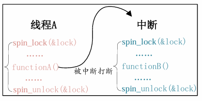

## 什么是并发/竞争

	简单来说，并发就是多个程序同时访问同一个共享资源。借用正点原子的例子来说，同事A和同事B同时想要用一台打印机，同事A要打印 AAAAA的内容同事B要打印BBBBB的内容，因为打印机不能做同时处理，如果强行同时处理很可能出现AABBA的打印内容。

在linux系统当中产生并发的原因主要以下几种

1. 多线程并发访问
2. 抢占式并发访问
3. 中断程序并发访问
4. SMP(多核)核间并发访问

并发访问带来的问题就是竞争，因此为了避免这个问题，就必须保证访问的共享资源的操作是原子的 （也就是访问共享资源一次访问只有一个步骤）

## 原子操作

	首先看一下原子操作，原子操作就是指不能再进一步分割的操作，一般原子操作用于变量或者位操作。

### 原子整形操作API函数

Linux内核定义了叫做atomic_t的结构体来完成整形数据的原子操作，在使用中用原子变量来代替整形变量，此结构体定义在include/linux/types.h文件中

```C
171 typedef struct { 
172     int counter; 
173 } atomic_t;
```

如果要使用原子操作API函数，首先要定义一个atomic_t变量

```C
atomic_t a;
```

同样可以给原子变量初始化的时候进行赋值

```C
atomic_t b = ATOMIC_INIT(0); //定义原子变量b并赋初值为0
```

对于原子操作的API表格


| API函数                                       | 描述                                                    |
| ----------------------------------------------- | --------------------------------------------------------- |
| `ATOMIC_INIT(int i)`                          | 定义原子变量时对其进行初始化。                          |
| `int atomic_read(atomic_t *v)`                | 读取原子变量`v` 的值并返回。                            |
| `void atomic_set(atomic_t *v, int i)`         | 将原子变量`v` 设置为 `i`。                              |
| `void atomic_add(int i, atomic_t *v)`         | 给原子变量`v` 加上 `i`。                                |
| `void atomic_sub(int i, atomic_t *v)`         | 从原子变量`v` 中减去 `i`。                              |
| `void atomic_inc(atomic_t *v)`                | 将原子变量`v` 加 `1`，即自增。                          |
| `void atomic_dec(atomic_t *v)`                | 将原子变量`v` 减 `1`，即自减。                          |
| `int atomic_dec_return(atomic_t *v)`          | 将`v` 减 `1`，并返回运算后的值。                        |
| `int atomic_inc_return(atomic_t *v)`          | 将`v` 加 `1`，并返回运算后的值。                        |
| `int atomic_sub_and_test(int i, atomic_t *v)` | 从`v` 中减去 `i`，如果结果为 `0` 则返回真，否则返回假。 |
| `int atomic_dec_and_test(atomic_t *v)`        | 将`v` 减 `1`，如果结果为 `0` 则返回真，否则返回假。     |
| `int atomic_inc_and_test(atomic_t *v)`        | 将`v` 加 `1`，如果结果为 `0` 则返回真，否则返回假。     |
| `int atomic_add_negative(int i, atomic_t *v)` | 给`v` 加上 `i`，如果结果为负数则返回真，否则返回假。    |

如果是64位的SOC，linux也定义了64位的原子结构体

```C
176 typedef struct { 
177     s64 counter; 
178 } atomic64_t;
```

原子位操作API表格


| API函数                                    | 描述                                               |
| -------------------------------------------- | ---------------------------------------------------- |
| `void set_bit(int nr, void *p)`            | 将地址`p` 的第 `nr` 位置 `1`。                     |
| `void clear_bit(int nr, void *p)`          | 将地址`p` 的第 `nr` 位清零。                       |
| `void change_bit(int nr, void *p)`         | 将地址`p` 的第 `nr` 位进行翻转。                   |
| `int test_bit(int nr, void *p)`            | 获取地址`p` 的第 `nr` 位的值。                     |
| `int test_and_set_bit(int nr, void *p)`    | 将地址`p` 的第 `nr` 位置 `1`，并返回该位原来的值。 |
| `int test_and_clear_bit(int nr, void *p)`  | 将地址`p` 的第 `nr` 位清零，并返回该位原来的值。   |
| `int test_and_change_bit(int nr, void *p)` | 将地址`p` 的第 `nr` 位翻转，并返回该位原来的值。   |

## 自旋锁

对于自旋锁而言，如果自旋锁正在被线程A持有，线程B想要获取自旋锁，那么线程B就会处于忙循环-旋转-等待状态，线程B不会进入休眠状态或者说去做其他的处理，而是会一直傻傻的在那里“转圈圈”的等待锁可用

在linux内核当中自旋锁的结构体定义

```C
typedef struct spinlock {
    union {
        struct raw_spinlock rlock;

#ifdef CONFIG_DEBUG_LOCK_ALLOC
#define LOCK_PADSIZE (offsetof(struct raw_spinlock, dep_map))

        struct {
            u8 __padding[LOCK_PADSIZE];
            struct lockdep_map dep_map;
        };
#endif
    };
} spinlock_t;
```

其操作API如下表格


| API函数                                | 描述                                                                |
| ---------------------------------------- | --------------------------------------------------------------------- |
| `DEFINE_SPINLOCK(spinlock_t lock)`     | 定义并初始化一个自旋锁变量。                                        |
| `spin_lock_init(spinlock_t *lock)`     | 初始化自旋锁。                                                      |
| `void spin_lock(spinlock_t *lock)`     | 获取指定的自旋锁，也叫加锁。                                        |
| `void spin_unlock(spinlock_t *lock)`   | 释放指定的自旋锁，也叫解锁。                                        |
| `int spin_trylock(spinlock_t *lock)`   | 尝试获取指定的自旋锁，如果获取失败则返回`0`。                       |
| `int spin_is_locked(spinlock_t *lock)` | 检查指定的自旋锁是否已被获取；如果已加锁则返回非`0`，否则返回 `0`。 |

上述自旋锁API函数适用于SMP或支持抢占的单CPU下线程之间的并发访问，也就是用于线程与线程之间，被自旋锁保护的临界区一定不能调用任何能够引起睡眠和阻塞的API 函数，否则的话会可能会导致死锁现象的发生。

通俗来说就是如果线程A在持有锁的期间进入了休眠的状态，那么线程A会放弃CPU使用权，线程B开始运行也想要获取锁，但是此时A并没有放弃锁，也没法运行，就发生了死锁现象。

在中断里也可以用自旋锁，但是中断里使用自旋锁需要禁止本地中断，否则可能发生死锁现象



如上图所示，线程A在拿到锁之后执行函数A，但这个时候发生中断，执行中断内的函数，在中断内也要获取锁，但此时A还没释放锁，就发生了死锁现象。

因此最好的方法就是在获取锁之前关闭本地中断，如下表提供了对应的api函数


| API函数                                                              | 描述                                           |
| ---------------------------------------------------------------------- | ------------------------------------------------ |
| `void spin_lock_irq(spinlock_t *lock)`                               | 禁止本地中断，并获取自旋锁。                   |
| `void spin_unlock_irq(spinlock_t *lock)`                             | 激活本地中断，并释放自旋锁。                   |
| `void spin_lock_irqsave(spinlock_t *lock, unsigned long flags)`      | 保存当前中断状态，禁止本地中断，并获取自旋锁。 |
| `void spin_unlock_irqrestore(spinlock_t *lock, unsigned long flags)` | 恢复之前保存的中断状态，并释放自旋锁。         |

建议使用spin_lock_irqsave/ spin_unlock_irqrestore，因为这一组函数会保存中断状态，在释放锁的时候会恢复中断状态

```C
1  DEFINE_SPINLOCK(lock)       /* 定义并初始化一个锁  */ 
2   
3  /* 线程A */ 
4  void functionA (){ 
5    unsigned long flags;         /* 中断状态     */ 
6    spin_lock_irqsave(&lock, flags)   /* 获取锁     */ 
7    /* 临界区 */ 
8    spin_unlock_irqrestore(&lock, flags) /* 释放锁     */ 
9  } 
10  
11 /* 中断服务函数 */ 
12 void irq() { 
13   spin_lock(&lock)          /* 获取锁     */ 
14   /* 临界区 */ 
15   spin_unlock(&lock)       /* 释放锁     */ 
16 }
```

下半部(BH)也有可能会发生竞争的现象（下半部: 把原本属于中断处理的一部分工作，推迟到稍后执行）


| API函数                                 | 描述                                            |
| ----------------------------------------- | ------------------------------------------------- |
| `void spin_lock_bh(spinlock_t *lock)`   | 关闭本地 CPU 的下半部（BH），并获取自旋锁。     |
| `void spin_unlock_bh(spinlock_t *lock)` | 释放自旋锁，并重新打开本地 CPU 的下半部（BH）。 |

## 其他类型锁

### 读写锁

读写自旋锁为读和写操作提供了不同的锁，一次只能允许一个写操作，也就是只能一个线程持有写锁，而且不能进行读操作。。但是当没有写操作的时候允许一个或多个线程持有读锁，可以进行并发的读操作

```C
typedef struct { 
	arch_rwlock_t raw_lock; 
} rwlock_t; 
```

读写锁API


| API函数                                                             | 描述                                     |
| --------------------------------------------------------------------- | ------------------------------------------ |
| `DEFINE_RWLOCK(rwlock_t lock)`                                      | 定义并初始化读写锁。                     |
| `void rwlock_init(rwlock_t *lock)`                                  | 初始化读写锁。                           |
| `void read_lock(rwlock_t *lock)`                                    | 获取读锁。                               |
| `void read_unlock(rwlock_t *lock)`                                  | 释放读锁。                               |
| `void read_lock_irq(rwlock_t *lock)`                                | 禁止本地中断，并获取读锁。               |
| `void read_unlock_irq(rwlock_t *lock)`                              | 打开本地中断，并释放读锁。               |
| `void read_lock_irqsave(rwlock_t *lock, unsigned long flags)`       | 保存中断状态，禁止本地中断，并获取读锁。 |
| `void read_unlock_irqrestore(rwlock_t *lock, unsigned long flags)`  | 恢复之前保存的中断状态，并释放读锁。     |
| `void read_lock_bh(rwlock_t *lock)`                                 | 关闭下半部，并获取读锁。                 |
| `void read_unlock_bh(rwlock_t *lock)`                               | 打开下半部，并释放读锁。                 |
| `void write_lock(rwlock_t *lock)`                                   | 获取写锁。                               |
| `void write_unlock(rwlock_t *lock)`                                 | 释放写锁。                               |
| `void write_lock_irq(rwlock_t *lock)`                               | 禁止本地中断，并获取写锁。               |
| `void write_unlock_irq(rwlock_t *lock)`                             | 打开本地中断，并释放写锁。               |
| `void write_lock_irqsave(rwlock_t *lock, unsigned long flags)`      | 保存中断状态，禁止本地中断，并获取写锁。 |
| `void write_unlock_irqrestore(rwlock_t *lock, unsigned long flags)` | 恢复之前保存的中断状态，并释放写锁。     |
| `void write_lock_bh(rwlock_t *lock)`                                | 关闭下半部，并获取写锁。                 |
| `void write_unlock_bh(rwlock_t *lock)`                              | 打开下半部，并释放写锁。                 |

### 顺序锁

	使用顺序锁的话可以允许在写的时候进行读操作，也就是实现同时读写，但是不允许同时进行并发的写操作

	虽然顺序锁的读和写操作可以同时进行，但是如果在读的过程中发生了写操作，最好重新进行读取，保证数据完整性。顺序锁保护的资源不能是指针，因为如果在写操作的时候可能会导致指针无效，而这个时候恰巧有读操作访问指针的话就可能导致意外发生，比如读取野指针导致系统崩溃。

```C
404 typedef struct { 
405    struct seqcount seqcount; 
406    spinlock_t lock; 
407 } seqlock_t; 
```

顺序锁API函数


| API函数                                                               | 描述                                                                   |
| ----------------------------------------------------------------------- | ------------------------------------------------------------------------ |
| `DEFINE_SEQLOCK(seqlock_t sl)`                                        | 定义并初始化顺序锁。                                                   |
| `void seqlock_init(seqlock_t *sl)`                                    | 初始化顺序锁。                                                         |
| `void write_seqlock(seqlock_t *sl)`                                   | 获取写顺序锁。                                                         |
| `void write_sequnlock(seqlock_t *sl)`                                 | 释放写顺序锁。                                                         |
| `void write_seqlock_irq(seqlock_t *sl)`                               | 禁止本地中断，并获取写顺序锁。                                         |
| `void write_sequnlock_irq(seqlock_t *sl)`                             | 打开本地中断，并释放写顺序锁。                                         |
| `void write_seqlock_irqsave(seqlock_t *sl, unsigned long flags)`      | 保存中断状态，禁止本地中断，并获取写顺序锁。                           |
| `void write_sequnlock_irqrestore(seqlock_t *sl, unsigned long flags)` | 恢复之前保存的中断状态，并释放写顺序锁。                               |
| `void write_seqlock_bh(seqlock_t *sl)`                                | 关闭下半部，并获取写顺序锁。                                           |
| `void write_sequnlock_bh(seqlock_t *sl)`                              | 打开下半部，并释放写顺序锁。                                           |
| `unsigned read_seqbegin(const seqlock_t *sl)`                         | 开始读取共享资源，并返回当前顺序锁的序列号。                           |
| `unsigned read_seqretry(const seqlock_t *sl, unsigned start)`         | 读取结束后检查读取过程中是否发生过写操作；如果发生过，则需要重新读取。 |

### 自旋锁注意事项

1. 锁的持有时间不能太长，以避免影响系统实时性能
2. 自旋锁保护的临界区内不能调用线程休眠的API函数，避免发生死锁
3. 不能递归申请自旋锁，当递归申请一个线程自己持有的锁，那么必须自旋，等待锁释放，但是由于正在处于自旋无法释放锁，所以就自锁
4. 为了考虑驱动可移植，必须将其档位多核SOC来编写驱动程序

## 信号量

信号量就是给共享资源发“许可证”：拿到许可证才能访问，拿不到就睡眠等待，用完以后归还许可证。因此信号量可以引起休眠

总结一下信号量的特点:

* 因为信号量可以使等待资源线程进入休眠状态，因此适用于那些占用资源比较久的场
  合。
* 信号量不能用于中断中，因为信号量会引起休眠，中断不能休眠。
* 如果共享资源的持有时间比较短，那就不适合使用信号量了，因为频繁的休眠、切换
  线程引起的开销要远大于信号量带来的那点优势。

信号量的结构体

```C
16 struct semaphore { 
17    raw_spinlock_t      lock; 
18    unsigned int        count; 
19    struct list_head    wait_list; 
20 }; 
```

信号量的API函数


| API函数                                          | 描述                                                                             |
| -------------------------------------------------- | ---------------------------------------------------------------------------------- |
| `DEFINE_SEMAPHORE(name)`                         | 定义并初始化一个信号量，初始值为`1`。                                            |
| `void sema_init(struct semaphore *sem, int val)` | 初始化信号量`sem`，并将信号量值设置为 `val`。                                    |
| `void down(struct semaphore *sem)`               | 获取信号量。如果暂时无法获取，会使当前线程进入休眠，因此不能在中断上下文中使用。 |
| `int down_trylock(struct semaphore *sem)`        | 尝试获取信号量；成功返回`0`，失败返回非 `0`，并且不会进入休眠。                  |
| `int down_interruptible(struct semaphore *sem)`  | 获取信号量；如果需要等待，线程会进入可被信号打断的休眠状态。                     |
| `void up(struct semaphore *sem)`                 | 释放信号量，使信号量值加`1`，并可能唤醒等待该信号量的线程。                      |

## 互斥锁

互斥访问表示一次只有一个线程可以访问共享资源，不能递归申请互斥体

```C
struct mutex { 
	atomic_long_t   owner; 
	spinlock_t      wait_lock; 
}; 
```

特点:

* mutex可以导致休眠，因此不能在中断中使用mutex，中断中只能使用自旋锁。
* 和信号量一样，mutex保护的临界区可以调用引起阻塞的API函数。
* 因为一次只有一个线程可以持有mutex，因此，必须由mutex的持有者释放mutex。并
  且mutex不能递归上锁和解锁

互斥锁API函数


| API函数                                            | 描述                                                           |
| ---------------------------------------------------- | ---------------------------------------------------------------- |
| `DEFINE_MUTEX(name)`                               | 定义并初始化一个`mutex` 互斥锁变量。                           |
| `void mutex_init(struct mutex *lock)`              | 初始化`mutex` 互斥锁。                                         |
| `void mutex_lock(struct mutex *lock)`              | 获取互斥锁，也就是加锁；如果获取不到，则当前线程进入休眠等待。 |
| `void mutex_unlock(struct mutex *lock)`            | 释放互斥锁，也就是解锁。                                       |
| `int mutex_trylock(struct mutex *lock)`            | 尝试获取互斥锁；成功返回`1`，失败返回 `0`，并且不会进入休眠。  |
| `int mutex_is_locked(struct mutex *lock)`          | 判断互斥锁是否已经被获取；已加锁返回`1`，否则返回 `0`。        |
| `int mutex_lock_interruptible(struct mutex *lock)` | 获取互斥锁；如果获取失败进入休眠，该休眠状态可以被信号打断。   |

## 总结

由于linux系统当中很有可能发生多个线程多个内核访问同一片资源，读写同一片资源的情形，因此需要引入多种保护机制，原子操作，自旋锁，读写锁，顺序锁，信号量，互斥锁对多线程访问同一资源的场景进行保护。

相比较于自旋锁和互斥锁，我刚开始认为这两个没什么差别，但实际上自旋锁会持续占用CPU等待锁释放，互斥锁在等待锁的时候会释放CPU资源，以休眠的形式等待锁
