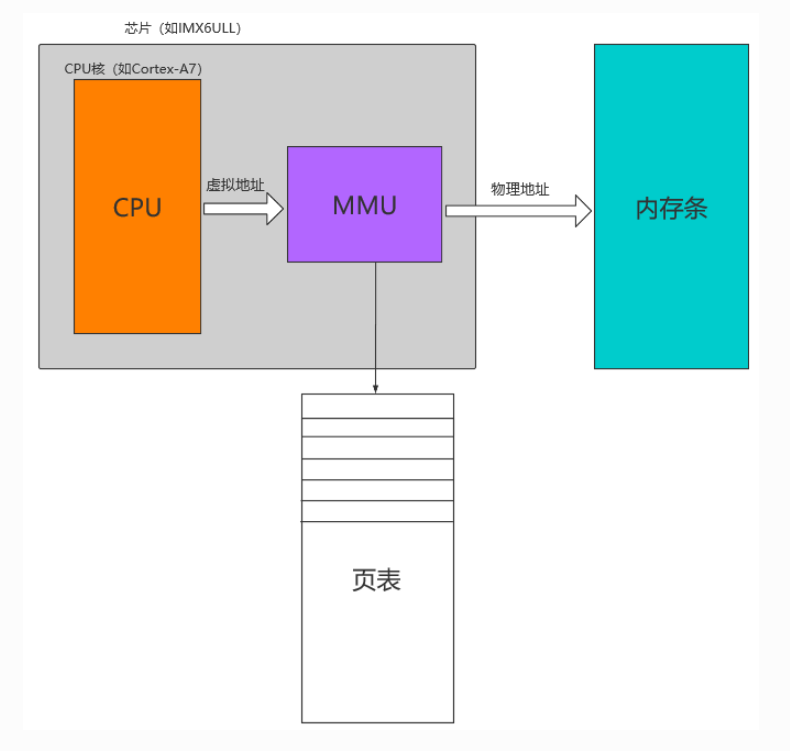
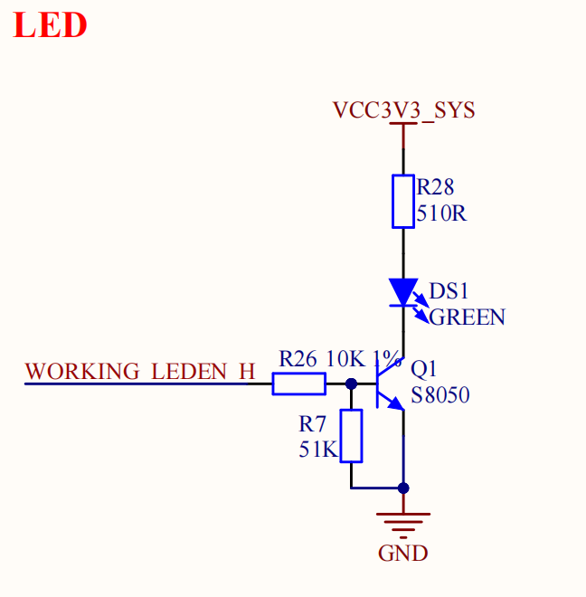
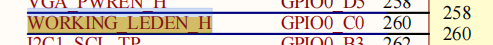
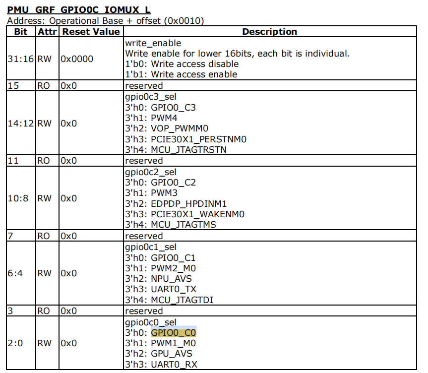
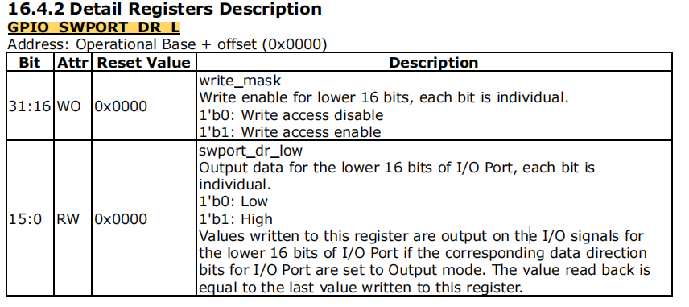
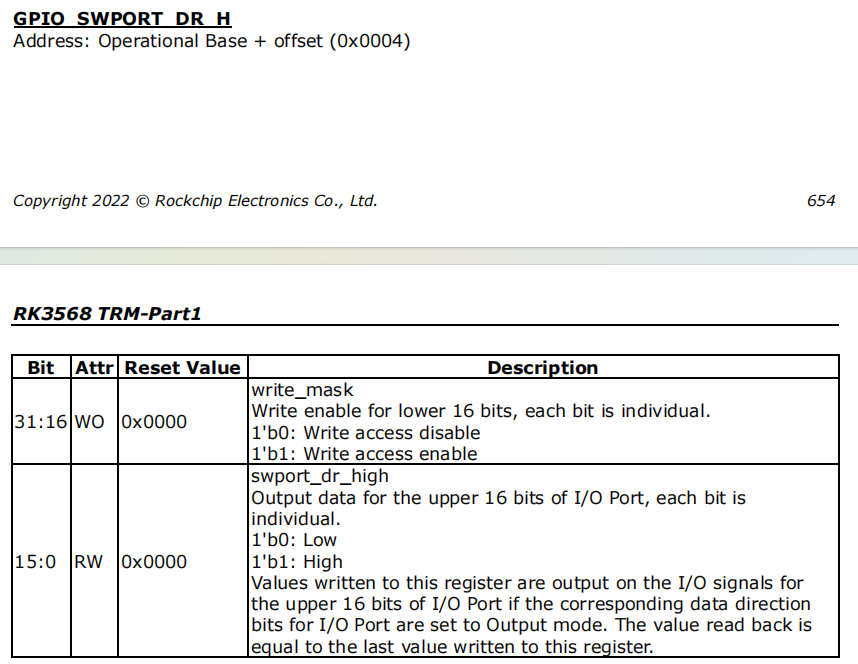
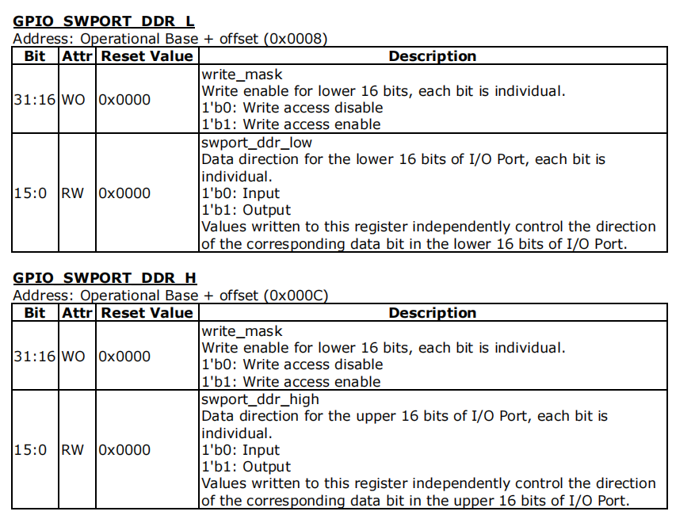
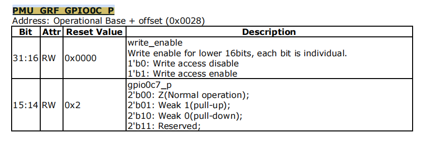

当我们最开始接触嵌入式设备的时候，使用STM32、ESP32甚至是C51单片机，第一步就是编写一段程序控制小灯亮灭，但是我们在编写的过程中，我们是直接对控制小灯对应引脚的寄存器做直接控制，这也叫做裸机开发，这样对寄存器做直接的操作很方便很快捷。但是当我们接触到可以搭载操作系统的嵌入式设备时就不是这么一回事了，会对设备驱动进行抽象，并对设备做物理地址到虚拟地址的映射，相比于裸机控制，变得更加复杂。

## 为什么要引入操作系统

我们固然知道操作系统随处可见，但是我们很难说清楚为什么要用操作系统，甚至我们裸机也可以开发的很好。但是事实真的是这样吗，我们必须承认对于设备的物理寄存器进行控制是个相当危险的操作，在程序运行的过程中，并不能确保所编写的逻辑能够天衣无缝的避开所有的漏洞，很有可能当程序出现偶然性的崩溃导致，比如栈溢出，野指针，段错误，访问错误地址等直接影响到设备运行。更何况一套设备要运行多个项目程序，比如无线通信，视频流输出，存储读写，都在并发执行。如果是在裸机的状况下，设备是在一个极度不安全的状况下运行，其中一个应用崩溃会导致所有功能全部崩溃。

因此我们需要引入操作系统去将物理层和应用层隔离，让应用层的崩溃不会影响到物理层，那应用层如何控制物理层的设备寄存器呢，既然无法直接控制寄存器的地址，这时候需要引用到一个虚拟内存MMU去实现

## MMU

### 什么是MMU

MMU为编程提供了方便统一的内存空间抽象，其实我们的程序中所写的变量地址是虚拟内存当中的地址， 倘若处理器想要访问这个地址的时候，MMU便会将此虚拟地址(Virtual Address)翻译成实际的物理地址(Physical Address)， 之后处理器才去操作实际的物理地址。他的主要作用是将虚拟地址翻译成真实的物理地址同时管理和保护内存， 不同的进程有各自的虚拟地址空间，某个进程中的程序不能修改另外一个进程所使用的物理地址，以此使得进程之间互不干扰，相互隔离。 而且我们可以使用虚拟地址空间的一段连续的地址去访问物理内存当中零散的大内存缓冲区

总结:

* **保护内存**
* **提供方便统一的内存空间抽象，实现虚拟地址到物理地址的转换**

### MMU转换过程



任何时候CPU发出的地址都是虚拟地址，为了实现虚拟地址到物理地址之间的映射， MMU内部有一个专门存放页表的页表地址寄存器，该寄存器存放着页表的具体位置， 用ioremap映射一段地址意味着使用户空间的一段地址关联到设备内存上， 这使得只要程序在被分配的虚拟地址范围内进行读写操作，实际上就是对设备(寄存器)的访问

但是上述的虚拟地址转换到物理地址的过程很好理解，但是假如我们要控制的物理地址在并不在首页的页表，而是在多级页表的后半部分页表，那么实际上在控制过程中会访问多次内存，因此会使用TLB的方案，先去找这个虚拟地址是否有对应的地址描述符如果有就可以直接进行转换。

（详细内容等到深入研究linux内核再进行介绍）

## 地址转换函数

1. ioremap函数

```C
void __iomem *ioremap(phys_addr_t paddr, unsigned long size)
#define ioremap ioremap
```

* **paddr：** 被映射的IO起始地址(物理地址)；
* **size：** 需要映射的空间大小，以字节为单位；

**返回值：** 一个指向__iomem类型的指针，当映射成功后便返回一段虚拟地址空间的起始地址，我们可以通过访问这段虚拟地址来实现实际物理地址的读写操作。

ioremap函数是依靠__ioremap函数来实现的，只是在__ioremap当中其最后一个要映射的I/O空间和权限有关的标志flag为0。

(注: 这个标志flag 为 0表示的是进行普通映射， 而并没有代表读写权限等含义)

在使用ioremap函数将物理地址转换成虚拟地址之后，理论上我们便可以直接读写I/O内存，但是为了符合驱动的跨平台以及可移植性， 我们应该使用linux中指定的函数(如：iowrite8()、iowrite16()、iowrite32()、ioread8()、ioread16()、ioread32()等)去读写I/O内存， 而非直接通过映射后的指向虚拟地址的指针进行访问。读写I/O内存的函数如下：

```C
unsigned int ioread8(void __iomem *addr)
unsigned int ioread16(void __iomem *addr)
unsigned int ioread32(void __iomem *addr)

void iowrite8(u8 b, void __iomem *addr)
void iowrite16(u16 b, void __iomem *addr)
void iowrite32(u32 b, void __iomem *addr)
```

注: 在ARM架构下，writex(readx)函数与iowritex(ioreadx)有一些区别， writex(readx)不进行端序的检查，而iowritex(ioreadx)会进行端序的检查

2. iounmap 函数

```C
void iounmap(void *addr)
#define iounmap iounmap
```

* **addr：** 需要取消ioremap映射之后的起始地址(虚拟地址)。

## 开始点灯

了解完所有的前置知识，终于可以开始点灯, 在点灯之前，我们首先需要知道对应LED灯的硬件连接方式，以及控制引脚是什么，学习板为正点原子RK3568。

### 前置准备



由于板子只有一个直接连接到RK3568的可控LED灯，因此直接将工作灯作为可控目标，并从WORKING_LEDEN_H网络标签继续查找



最后得到LED对应三极管基极网络标签的真实GPIO为 GPIO0_C0。 同时根据三极管特性可以知道，GPIO0_C0 拉高绿灯亮， 拉低绿灯灭。

现在我们知道具体控制LED灯的GPIO引脚，我们需要从RK3568的数据手册区查找对应GPIO的定义，并查找控制该GPIO的寄存器以及控制位


通过查询数据手册我们可以知道这个引脚可以复用为PWM 串口输入引脚和GPUAVS引脚，并且其编号为AD22，通过TRM手册



如果我们想要控制GPIO0_C0 首先需要将GPIO0_C0设置为可写即设置控制字，也就如上图寄存器表格所示，低十六位选择对应的GPIO模式 0x0000, 高十六位对GPIO0_C0 所在片选引脚寄存器写使能0x0007, 合并之后对于PMU_GRF_GPIO0C_IOMUX_L 的寄存器写入值为 0x00070000





以GPIO_SWPORT_DR_L寄存器说明，该寄存器有高16bit和低16bit，高16bit控制低16bit的写使能，低16bit控制GPIO的高低电平，GPIO_SWPORT_DR_H同理。 如果要控制GPIO0_C0的高低电平那么就要写GPIO_SWPORT_DR_H寄存器。

* GPIO_SWPORT_DR_L：低位引脚数据寄存器，设置高低电平。
* GPIO_SWPORT_DR_H：高位引脚数据寄存器，设置高低电平。

其控制寄存器的字段设置逻辑是这样的 首先我们知道了GPIO0_C0 这个控制引脚，也就是在Bank 0 的 C0引脚

Bank:指的是嵌入式芯片将gpio引脚划分为不同的区域，对于rk3568一共有 5个GPIO的bank分别为 GPIO0/GPIO1/GPIO2/GPIO3/GPIO4

在每个Bank当中又分为不同的族，比如在GPIO0这个Bank区的引脚分为 ABCD 四个族 每个族分别对应 8 个不同的引脚。比如对于A族有A0 A1 A2 .....A7 八个单独可控的GPIO

所以从理论关系来看，每个Bank对应的引脚号
GPIO0 → 0   ~ 31  (A： 0 ~ 7  B:  8 ~ 15 C: 16 ~ 23 D: 24 ~ 31)
GPIO1 → 32  ~ 63
GPIO2 → 64  ~ 95
GPIO3 → 96  ~ 127
GPIO4 → 128 ~ 159

因此我们来看，如果我们要设置GPIO0_C0这个引脚的电平为高电平，我们先来计算一下应当设置到哪个引脚数据寄存器

由于这个引脚属于Rank 0 区，C0引脚，因此可以得到其引脚编号为 8 x (3 - 1) = 16 因此需要在 GPIO_SWPORT_DR_H寄存器进行设置。首先对GPIO_SWPORT_DR_H高十六位对应的写入状态置为 1 表示可写也就是 0x0001， 将低十六位的第一位设置为 1，表示高电平也就是 0x0001，最终写入到GPIO_SWPORT_DR_H寄存器为 0x00010001. 同理控制其它引脚也是相同的控制办法。

我们知道了如何设置引脚电平，我们同样需要知道如何设置引脚的输入输出方向，来查看一下输入输出在寄存器如何定义



* GPIO_SWPORT_DDR_L：低位引脚数据方向寄存器，控制输入或者输出。
* GPIO_SWPORT_DDR_H：高位引脚数据方向寄存器，控制输入或者输出。

其中设置低十六位对应位为0 则输入，对应位设置为1为输出。

因此，由于我们需要使用引脚去输出电平去控制LED，我们需要设置GPIO0_C0为输出状态。同理按照上述的计算公式计算出GPIO0_C0的引脚编号，其对应的寄存器为GPIO_SWPORT_DDR_H，写入寄存器的值为0x00010001

对引脚控制之前，引脚会经过初始化，我们需要定义引脚初始化的状态，一共有三个状态 上拉，下拉，悬空

* 上拉: 默认引脚为高电平
* 下拉: 默认引脚为低电平
* 悬空: 浮空状态




对于控制引脚初始化状态上下拉的寄存器，每个Bank的一个族都对应一个寄存器，高十六位对应位写使能，低十六位确定引脚上下拉状态。现在我们默认将GPIO0_C0为下拉模式，也就是默认初始化状态为低电平，由于低十六位的每个引脚状态占据两位，因此需要将高十六位的低两位置 1，也就是0x0003, 低十六位[1:0]设置为 2‘b10 表示下拉，也就是0x0002, 因此写入该寄存器的值为 0x00030002

现在所有寄存器该设置的数值已经清楚了，需要确定对应操作寄存器的基地址以及对应寄存器的偏移地址，通过数据手册


GPIO0的基地址为 0xFDD60000，PMU_GRF基地址为 0xFDC20000, 因此偏移表如下


| 寄存器                 | 偏移地址 | 作用                     | 基地址     | 物理地址   |
| ------------------------ | ---------- | -------------------------- | ------------ | ------------ |
| PMU_GRF_GPIO0C_IOMUX_L | 0x0010   | 选择引脚模式             | 0xFDC20000 | 0xFDC20010 |
| GPIO_SWPORT_DR_L       | 0x0000   | 低十六位高低电平引脚设置 | 0xFDD60000 | 0xFDD60000 |
| GPIO_SWPORT_DR_H       | 0x0004   | 高十六位高低电平引脚设置 | 0xFDD60000 | 0xFDD60004 |
| GPIO_SWPORT_DDR_L      | 0x0008   | 低十六位引脚方向设置     | 0xFDD60000 | 0xFDD60008 |
| GPIO_SWPORT_DDR_H      | 0x000C   | 高十六位引脚方向设置     | 0xFDD60000 | 0xFDD6000C |
| PMU_GRF_GPIO0C_P       | 0x0028   | 设置引脚默认状态         | 0xFDC20000 | 0xFDC20028 |

因此有了这些物理地址的映射表我们就可以按照前几个章节的内核模块的构建方式去构建LED 的驱动模块代码

### 编写代码

同样我们将内核模块架构分为三个部分

* file_operations.c/.h： 统一字符文件操作对象
* led_drivers.c：LED内核模块代码
* led_test_app.c: LED内核模块测试代码

我们将LED的字符设备封装为一个结构体， 抽象为一个可被读写控制的对象

```C
struct LedChardevType
{
    struct cdev dev; // 字符设备结构体 
    uint32_t __iomem *va_dr; // 设置输出电平对应虚拟地址
    uint32_t __iomem *va_ddr;// 设置输出方向对应虚拟地址
    uint32_t led_pin;    // 引脚偏移 
};
```

并对该结构体对象进行实例化，字符设备常规初始化流程， 并对设置GPIO的引脚输入输出方向，默认输出电平做地址重映射到虚拟地址，并做初始化

```C
#include "include/file_operations.h"


dev_t dev_num; // 设备号
static struct device*  device; // 设备对象
static struct class* class;    // 类

// 数组实例化，支持多LED
static struct LedChardevType chr_leds[LED_CNT] = 
{
    {.led_pin = 0},// GPIO0_C0
};


static int __init  led_driver_init (void)
{
    int ret = 0; // 返回状态
    uint32_t write_val = 0x00; // 待写入寄存器变量
    printk("led driver init \r\n");
    // 重映射引脚方向物理地址 ——> 虚拟地址
    // GPIO0_C0 属于高十六位
    chr_leds[0].va_ddr = ioremap(GPIO_SWPORT_DDR_H, 4);
    // 重映射引脚电平物理地址 ——> 虚拟地址
    chr_leds[0].va_dr  = ioremap(GPIO_SWPORT_DR_H, 4);
    // 如果重映射失败
    if (!chr_leds[0].va_ddr || !chr_leds[0].va_dr)
    {
        printk("fail to remap gpio register \r\n");
        ret = -ENOMEM;
        goto err_iounmap;
    }

    // 写入引脚的输出方向
    write_val = ioread32(chr_leds[0].va_ddr); // 先读取一下默认值
    // write_val = write_val | 0x00010001;
    write_val |= (WRITE_PERMIT << (16 + chr_leds[0].led_pin)); // 高十六位使能写入权限
    write_val |= DIR_INPUT << chr_leds[0].led_pin;      // 低十六位写入方向
    iowrite32(write_val, chr_leds[0].va_ddr);

    // 设置引脚的默认电平
    write_val = ioread32(chr_leds[0].va_dr);
    // write_val = write_val | 0x00030002;
    write_val |= (WRITE_PERMIT << (16 + chr_leds[0].led_pin)); // 使能寄存器低两位的写入权限
    write_val |= (LOW << chr_leds[0].led_pin);  
    iowrite32(write_val, chr_leds[0].va_dr);

    // 分配设备号
    ret = alloc_chrdev_region(&dev_num, 0, LED_CNT, CHR_NAME);
    // 分配失败
    if (ret < 0)
    {
        printk("alloc dev num failed \r\n");
        goto err_iounmap;
    }
    // 绑定文件操作fp
    chr_leds[0].dev.owner = THIS_MODULE;
    // 初始化led字符设备，并绑定文件操作符
  	cdev_init(&chr_leds[0].dev, get_fp());
  	// 添加设备到散列表
    ret = cdev_add(&chr_leds[0].dev, dev_num, LED_CNT);
    if (ret < 0)
    {
        printk("add error \r\n");
        goto err_unregister;
    }


    // 创建设备类
    class = class_create(THIS_MODULE, CHR_NAME);
    if (IS_ERR(class))
    {
        cdev_del(&chr_leds[0].dev); // 删除设备
        printk("class create fail \r\n");
        ret = -1;
        goto err_unregister;
    }

    // 创建设备节点 
    device = device_create(class, NULL, dev_num, NULL, "ChrLed");
    if (IS_ERR(device))
    {
        printk("create device node fail \r\n");
        class_destroy(class); 
        ret = PTR_ERR(device); // 指针错误状态码
        goto err_cdev;
    }
    return 0;

err_cdev:
	// 删除字符设备
    cdev_del(&chr_leds[0].dev);
err_unregister:
	// 注销设备号
    unregister_chrdev_region(dev_num, LED_CNT);
err_iounmap:
	// 取消虚拟地址
    if (chr_leds[0].va_ddr)
        iounmap(chr_leds[0].va_ddr);
    if (chr_leds[0].va_dr)
        iounmap(chr_leds[0].va_dr);
    return ret;
}

static void __exit led_driver_deinit(void)
{
    printk("exit led driver \r\n");
    // 删除设备节点
    device_destroy(class, dev_num);
    // 删除类
    class_destroy(class);
    // 删除字符设备
    cdev_del(&chr_leds[0].dev);
    // 注销设备号
    unregister_chrdev_region(dev_num, LED_CNT);
    // 取消虚拟地址映射
    iounmap(chr_leds[0].va_ddr);
    iounmap(chr_leds[0].va_dr);
}


module_init(led_driver_init);
module_exit(led_driver_deinit);
MODULE_LICENSE("GPL");
```

对于一些定义我们将其定义在file_operations.h 头文件

```C
#ifndef __FILE_OPERATIONS_H
#define __FILE_OPERATIONS_H

#include <linux/kernel.h>
#include <linux/module.h>
#include <linux/init.h>
#include <linux/io-mapping.h>
#include <linux/cdev.h>

#define LED_CNT                (1)           // LED数量
#define CHR_NAME               ("ChrLED")	 // 字符设备名称
#define PMU_GRF_GPIO0C_IOMUX_L (0xFDC20010)  // GPIO引脚复用 物理地址
#define GPIO_SWPORT_DR_L       (0xFDD60000)	 // GPIO输出电平 低十六位 物理地址
#define GPIO_SWPORT_DR_H       (0xFDD60004)	 // GPIO输出电平 高十六位 物理地址
#define GPIO_SWPORT_DDR_L      (0xFDD60008)  // GPIO输入输出方向 低十六位 物理地址
#define GPIO_SWPORT_DDR_H      (0xFDD6000C)  // GPIO输入输出方向 高十六位 物理地址
#define PMU_GRF_GPIO0C_P       (0xFDC20028)  // GPIO0_Cx设置默认引脚上下拉 悬空 寄存器物理地址

#define DIR_OUTPUT             (1)	// 寄存器定义 输出为 1
#define DIR_INPUT              (0)  // 寄存器定义 输入为 0
#define WRITE_PERMIT           (1)  // 寄存器定义 可写为1 不可写为0 
#define HIGH                   (1)  // 寄存器定义 高电平为 1
#define LOW                    (0)  // 寄存器定义 低电平为 0 

struct LedChardevType
{
    struct cdev dev; // 字符设备结构体 
    uint32_t __iomem *va_dr; // 设置输出电平对应虚拟地址
    uint32_t __iomem *va_ddr;// 设置输出方向对应虚拟地址
    uint32_t led_pin;    // 引脚偏移 
};

struct file_operations * get_fp(void); // 返回文件操作结构体地址


#endif
```

而对于文件操作的主要内容来看，就比较简单，主要需要绑定三个函数指针，open / release / write

```C
#include "include/file_operations.h"

static int fp_led_open(struct inode *inode, struct file *filp);
static ssize_t fp_led_write(struct file *filp, const char __user *buf, 
                        size_t count, loff_t *ppos);
static int fp_led_release(struct inode *inode, struct file *filp);


struct file_operations fp = 
{
    .open = fp_led_open,
    .write = fp_led_write,
    .release = fp_led_release
};

static int fp_led_open(struct inode *inode, struct file *filp)
{
  	// 获取到对应字符文件设备的地址
    struct LedChardevType *led_cdev = container_of(inode->i_cdev, struct LedChardevType, dev);
  	filp->private_data = led_cdev;
    printk("led driver fp open\r\n");
    return 0;
}

static ssize_t fp_led_write(struct file *filp, const char __user *buf, 
                        size_t count, loff_t *ppos)
{
    int ret = 0;
    uint32_t val = 0;
    struct LedChardevType *led_cdev = filp->private_data; // 获取对象字符文件
    printk("led operation write \r\n");
    get_user(ret, buf); // 获取从应用层用户端下发的指令
    if (ret == '0')
    {
        val |= (WRITE_PERMIT << (16 + led_cdev->led_pin)); // 使能寄存器低两位的写入权限
        val |= (LOW << led_cdev->led_pin);  // 设置为低电平
        iowrite32(val, led_cdev->va_dr);
    }
    else if (ret == '1')
    {
        val |= (WRITE_PERMIT << (16 + led_cdev->led_pin)); // 使能寄存器低两位的写入权限
        val |= (HIGH << led_cdev->led_pin);  // 设置为高电平
        iowrite32(val, led_cdev->va_dr);
    }
    else
    {
        printk("Unknow number \r\n");
    }
    return 0;
}

static int fp_led_release(struct inode *inode, struct file *filp)
{
    printk("fp led release \r\n");
    return 0;
}

struct file_operations *get_fp(void)
{
    return &fp;
}
```

而对于测试led的驱动文件，则使用了常见的led灯间隔一秒闪烁的方式进行验证

```C
#include <stdio.h>
#include <unistd.h>
#include <fcntl.h>
#define LED_ON  ('1')
#define LED_OFF ('0')

int main (int argc, char *argv[])
{
    int fd;
    char *file_path; 
    char cmd[1];
    file_path = argv[1];
    fd = open(file_path, O_RDWR);
    if (fd < 0)
    {
        printf("open %s error \r\n", file_path);
        return -1;
    }

    while (1)
    {
        cmd[0] = LED_ON;
        write(fd, cmd, 1);
        printf("LED ON \r\n");
        sleep(1);
        cmd[0] = LED_OFF;
        write(fd, cmd, 1);
        printf("LED OFF \r\n");
        sleep(1);
    }

    return 0;
}
```

Makefile文件

```CMake
# 内核路径、目标架构和交叉编译器。
KERNEL_DIR ?= ../..
ARCH ?= arm64
CROSS_COMPILE ?= aarch64-linux-gnu-
export ARCH CROSS_COMPILE

ccflags-y += -I$(src)/include
obj-m += led_driver_module.o
led_driver_module-y := led_driver.o file_operations.o 

test_app = led_test_app

all:
	$(MAKE) -C $(KERNEL_DIR) M=$(CURDIR) modules
	$(CROSS_COMPILE)gcc -std=gnu11 -Wall -Wextra -o $(test_app) $(test_app).c

.PHONY: clean
clean:
	$(MAKE) -C $(KERNEL_DIR) M=$(CURDIR) clean
	rm -f $(test_app)
```

值得注意的是，在编写内核驱动模块代码的过程中，我在尝试不使用goto语句去编写错误状态的资源释放情况，发现会造成很多的代码冗余，相比较之下使用goto语句可以很好的规避掉这个问题，当出现不同阶段的设备资源申请错误，会跳转到对应的释放开始区顺序释放，而避免忘记释放资源。

编译完成之后即可使用adb上传到板卡端进行验证

```Shell
root@ATK-DLRK3568:/home/ftp# insmod /lib/modules/led_driver_module.ko
[ 2263.167355] led driver init
root@ATK-DLRK3568:/home/ftp# ./led_test_app /dev/ChrLed
[ 2273.301841] led driver fp open
[ 2273.302021] led operation write
LED ON
[ 2274.302588] led operation write
LED OFF
[ 2275.303130] led operation write
LED ON
[ 2276.303649] led operation write
LED OFF
[ 2277.304173] led operation write
LED ON
[ 2278.304531] led operation write
LED OFF
[ 2279.305081] led operation write
LED ON
[ 2280.305742] led operation write
LED OFF
[ 2281.306241] led operation write
LED ON
[ 2282.306605] led operation write
LED OFF
[ 2283.306960] led operation write
LED ON
[ 2284.307466] led operation write
LED OFF
^C[ 2284.546250] fp led release
```

最终的效果

<video width="320" height="240" controls autoplay muted playsinline preload="metadata">
<source src="/notes-assets/linux/image/linux驱动学习日记--点亮一盏LEDD灯/1790520479571.mp4" type="video/mp4">
</video>

[](https://)
