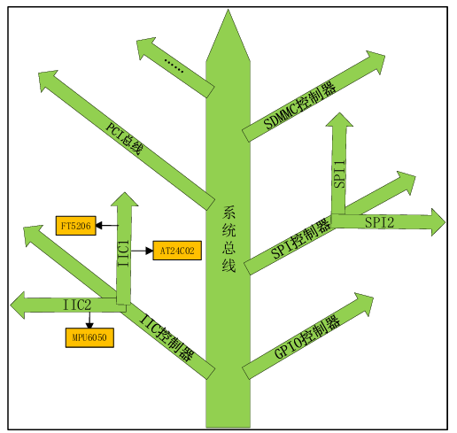

## 设备树？

设备树(Device Tree)，将这个词分开就是“设备”和“树”，描述设备树的文件叫做DTS(Device Tree Source)，这个 DTS 文件采用树形结构描述板级设备，也就是开发板上的设备信息，比如CPU数量、 内存基地址、IIC接口上接了哪些设备、SPI接口上接了哪些设备等等，



### DTS、DTB和DTC

DTS是设备树源码文件，DTB是将DTS编译以后得到的二进制文件，将.dts编译为.dtb需要用到DTC工具。

基于ARM架构的SOC有很多种，一种SOC可以制作出很多的板子，每个板子有对应的DTS文件，如何确定编译哪一个DTS文件，以RK3568为例，在

arch/arm64/boot/dts/rockchip/Makefile的Makefile文件下

```CMake
# SPDX-License-Identifier: GPL-2.0
dtb-$(CONFIG_ARCH_ROCKCHIP) += px30-evb.dtb
dtb-$(CONFIG_ARCH_ROCKCHIP) += px30-evb-ddr3-v10.dtb
dtb-$(CONFIG_ARCH_ROCKCHIP) += px30-evb-ddr3-v10-avb.dtb
dtb-$(CONFIG_ARCH_ROCKCHIP) += px30-evb-ddr3-v10-linux.dtb
dtb-$(CONFIG_ARCH_ROCKCHIP) += px30-mini-evb-ddr3-v11.dtb
dtb-$(CONFIG_ARCH_ROCKCHIP) += px30-mini-evb-ddr3-v11-avb.dtb
dtb-$(CONFIG_ARCH_ROCKCHIP) += px30-evb-ddr3-v11-linux.dtb
dtb-$(CONFIG_ARCH_ROCKCHIP) += px30-evb-ddr4-v10.dtb
dtb-$(CONFIG_ARCH_ROCKCHIP) += px30-evb-ddr4-v10-linux.dtb
dtb-$(CONFIG_ARCH_ROCKCHIP) += rk3308-evb.dtb
dtb-$(CONFIG_ARCH_ROCKCHIP) += rk3308-evb-amic-v11.dtb
dtb-$(CONFIG_ARCH_ROCKCHIP) += rk3308-evb-amic-v13.dtb
dtb-$(CONFIG_ARCH_ROCKCHIP) += rk3308-evb-dmic-pdm-v11.dtb
dtb-$(CONFIG_ARCH_ROCKCHIP) += rk3308-evb-dmic-pdm-v13.dtb
dtb-$(CONFIG_ARCH_ROCKCHIP) += rk3308-roc-cc.dtb
```

以看出，比如这个Makefile下有许多RK3326、RK3566、RK3568等不同的.dtb文件。如果我们使用RK3568新做了一个板子，只需要新建一个此板子对应的.dts文件，然后将对应的.dtb文件名添加到这个Makefile下，这样在编译设备树的时候就会将对应的.dts编译为二进制的.dtb文件

### 设备树语法

* .dtsi: 设备树的头文件扩展名, 一般.dtsi文件用于描述SOC的内部外设信息，比如CPU架构、主频、外设寄存器地址范围，比如UART、IIC等等

```C
// 在dts源文件中， 可以使用include 引用头文件
#include "xxxx.dtsi"
#include "xxxx.h"
```

* .dts: 设备树源文件

1. ” / “: 根节点
2. node-name@unit-address: 节点名字@设备地址/寄存器首地址

   通常会使用标签的形式和上述节点表示进行组合

```
cpu0:cpu@0
```

引入label的目的就是为了方便访问节点，可以直接通过&label来访问这个节点，比如通过&cpu0就可以访问“cpu@f00”这个节点

3. 属性: 每个节点都有不同属性，不同的属性又有不同的内容，属性都是键值对，值可以为空或任意的字节流

* 字符串: 例如compatible = "rockchip,rk3568";
* 32位无符号整数: 例如 reg = <0>; 上述代码设置reg属性的值为0

  也可以设置为一组数值reg = <0 0x123456 100>;
* 字符串列表: 属性值也可以为字符串列表，字符串和字符串之间采用“,”隔开 compatible = "rockchip,rk3568-evb ", "rockchip,rk3568";

#### 标准属性

1. compatible属性: 用于将设备和驱动绑定起来 （字符串类型）

```Shell
"manufacturer,model"
```

* manufacturer: 厂商名
* model: 驱动模块名称

  支持多属性值例如

```Shell
compatible = "ilitek,ili9881d", "simple-panel-dsi";
```

首先使用第一个兼容值在linux内核查找，如果找不到用第二个兼容值查找

2. model属性: 描述开发板的名字或者设备模块信息 (字符串类型)

```Shell
model = "Rockchip rk3568 EVB DDR4 V10 Board";
```

3. status属性: 描述设备状态 (字符串类型)


| 值           | 描述                                                                                                                     |
| -------------- | -------------------------------------------------------------------------------------------------------------------------- |
| “okay”     | 设备可操作                                                                                                               |
| “disabled” | 表明设备当前是不可操作的，但是在未来可以变为可操作的，比如热插拔设备插入以后。至于disabled的具体含义还要看设备的绑定文档 |
| “fail”     | 表明设备不可操作，设备检测到了一系列的错误，而且设备也不大可能变得可操作。                                               |
| “fail-sss” | 含义和“fail”相同，后面的sss部分是检测到的错误内容。                                                                    |

4. #address-cells和#size-cells属性 （uint32 类型）

这两个属性可以用在任何拥有子节点的设备中，用于描述子节点的地址信息

* #address-cells: 决定了子节点reg属性中地址信息所占用的字长(32位)，
* #size-cells: 值决定了子节点reg属性中长度信息所占的字长(32位)

5. reg属性：描述设备地址空间资源信息或者设备地址信息

```Shell
reg = <address1 length1 address2 length2 address3 length3……>
```

* address: 起始地址
* length: 地址长度

6. ranges属性: 是一个地址映射/转换表,每个项目由子地址、父地址和地址空间长度这三部分组成

* child-bus-address：子总线地址空间的物理地址，由父节点的#address-cells确定此物理地址所占用的字长。
* parent-bus-address：父总线地址空间的物理地址，同样由父节点的#address-cells确定此物理地址所占用的字长
* length： 子地址空间的长度，由父节点的#size-cells确定此地址长度所占用的字长。

7. name 属性：记录节点名字 （弃用）
8. device_type 属性: 用于描述设备的 FCode (弃用)

#### 向节点增加或修改内容

在实际的开发过程中，我们必不可少的会遇到更换硬件，比如IIC总线上挂载的MPU6050更换为fxls8471，因此我们需要在对应IIC这个节点挂载一个新的节点，例如我们使用IIC5

```Shell
&i2c5:{
	# 追加的内容
    status = "okay";
    clock-frequency = <400000>;

    fxls8471@1e{
    	compatible = "fsl, fxls8471";
        reg = <0x1e>;
    };
};
```

通常我们可以在 Linux源码目录/Documentation/devicetree/bindings下去查看如何给SOC添加设备节点

#### 特殊节点

1. aliases 子节点： 定义别名，方便查找节点

```Shell
26 aliases { 
27  i2c0 = &i2c0; 
28  i2c1 = &i2c1; 
29  i2c2 = &i2c2; 
30  i2c3 = &i2c3; 
...... 
44  dphy0 = &csi_dphy0; 
45  dphy1 = &csi_dphy1; 
46 };
```

2. chosen子节点: 为了uboot向Linux内核传递数据，重点是 bootargs 参数

#### OF 操作函数

设备都是以节点的形式“挂”到设备树上的，因此要想获取这个设备的其他属性信息，必须先获取到这个设备的节点。

```C
struct device_node {
	const char *name; // 节点名称
	phandle phandle;
	const char *full_name; // 节点全名称
	struct fwnode_handle fwnode;

	struct	property *properties; // 属性
	struct	property *deadprops;	/* removed properties */
	struct	device_node *parent; // 父节点
	struct	device_node *child;	 // 子节点
	struct	device_node *sibling;
#if defined(CONFIG_OF_KOBJ)
	struct	kobject kobj;
#endif
	unsigned long _flags;
	void	*data;
#if defined(CONFIG_SPARC)
	unsigned int unique_id;
	struct of_irq_controller *irq_trans;
#endif
};
```

查找节点

1. of_find_node_by_name 函数

```C
struct device_node *of_find_node_by_name(struct device_node  *from,  
const char    *name);
```

* from：开始查找的节点，如果为NULL表示从根节点开始查找整 个设备树。
* name：要查找的节点名字。
* 返回值：找到的节点，如果为NULL表示查找失败。

2. of_find_node_by_type函数

```C
struct device_node *of_find_node_by_type(struct device_node *from, const char *type)
```

* from：开始查找的节点，如果为NULL表示从根节点开始查找整个设备树。
* type：要查找的节点对应的type字符串，也就是device_type属性值。
* 返回值：找到的节点，如果为NULL表示查找失败。

3. of_find_compatible_node函数

```C
struct device_node *of_find_compatible_node(struct device_node  *from,  
       										const char    *type,  
          									const char    *compat)
```

* from：开始查找的节点，如果为NULL表示从根节点开始查找整个设备树。
* type：要查找的节点对应的type字符串，也就是device_type属性值，可以为NULL，表示忽略掉device_type 属性。
* compat：要查找的节点所对应的compatible属性列表。
* 返回值：找到的节点，如果为NULL表示查找失败。

4. of_find_matching_node_and_match函数

```C
struct device_node *of_find_matching_node_and_match(struct device_node   *from, 
													const struct of_device_id  *matches, 
													const struct of_device_id **match) 
```

* from：开始查找的节点，如果为NULL表示从根节点开始查找整个设备树。
* matches：of_device_id 匹配表，也就是在此匹配表里面查找节点。
* match：找到的匹配的of_device_id。
* 返回值：找到的节点，如果为NULL表示查找失败

5. of_find_node_by_path 函数

of_find_node_by_path 函数通过路径来查找指定的节点，函数原型如下：

```C
inline struct device_node *of_find_node_by_path(const char *path)
```

* path：带有全路径的节点名，可以使用节点的别名，比如“/backlight”就是backlight这个节点的全路径。
* 返回值：找到的节点，如果为NULL表示查找失败。

#### 查找父/子节点的OF函数

Linux 内核提供了几个查找节点对应的父节点或子节点的OF函数，我们依次来看一下。

1. of_get_parent 函数

of_get_parent 函数用于获取指定节点的父节点，函数原型如下：

```C
struct device_node *of_get_parent(const struct device_node *node)
```

* node：要查找父节点的节点。
* 返回值：找到的父节点，如果没有父节点则返回NULL。

2. of_get_next_child 函数

of_get_next_child 函数用于迭代查找节点的子节点，函数原型如下：

```C
struct device_node *of_get_next_child(const struct device_node *node,
                                      struct device_node *prev)
```

* node：父节点。
* prev：前一个子节点，也就是从哪一个子节点开始迭代查找下一个子节点。可以设置为NULL，表示从第一个子节点开始。
* 返回值：找到的下一个子节点，如果没有下一个子节点则返回NULL。

#### 提取属性值的OF函数

节点的属性信息里面保存了驱动所需要的内容，因此对于属性值的提取非常重要。

1. of_find_property 函数

of_find_property 函数用于查找指定的属性，函数原型如下：

```C
struct property *of_find_property(const struct device_node *np,
                                  const char *name,
                                  int *lenp)
```

* np：设备节点。
* name：属性名字。
* lenp：属性值的字节数。
* 返回值：找到的属性，如果没有找到则返回NULL。

2. of_property_count_elems_of_size 函数

of_property_count_elems_of_size 函数用于获取属性中元素的数量，比如reg属性值是一个数组，那么使用此函数可以获取到这个数组的大小，函数原型如下：

```C
int of_property_count_elems_of_size(const struct device_node *np,
                                    const char *propname,
                                    int elem_size)
```

* np：设备节点。
* propname：需要统计元素数量的属性名字。
* elem_size：元素长度。
* 返回值：得到的属性元素数量，负值表示失败。

3. of_property_read_u32_index 函数

of_property_read_u32_index 函数用于从属性中获取指定标号的u32类型数据值，函数原型如下：

```C
int of_property_read_u32_index(const struct device_node *np,
                               const char *propname,
                               u32 index,
                               u32 *out_value)
```

* np：设备节点。
* propname：要读取的属性名字。
* index：要读取的值标号。
* out_value：读取到的值。
* 返回值：0表示读取成功，负值表示读取失败。-EINVAL表示属性不存在，-ENODATA表示没有要读取的数据，-EOVERFLOW表示属性值列表太小。

4. of_property_read_u8_array、of_property_read_u16_array、of_property_read_u32_array、of_property_read_u64_array 函数

这4个函数分别用于读取属性中的u8、u16、u32和u64类型数组数据，函数原型如下：

```C
int of_property_read_u8_array(const struct device_node *np,
                              const char *propname,
                              u8 *out_values,
                              size_t sz)

int of_property_read_u16_array(const struct device_node *np,
                               const char *propname,
                               u16 *out_values,
                               size_t sz)

int of_property_read_u32_array(const struct device_node *np,
                               const char *propname,
                               u32 *out_values,
                               size_t sz)

int of_property_read_u64_array(const struct device_node *np,
                               const char *propname,
                               u64 *out_values,
                               size_t sz)
```

* np：设备节点。
* propname：要读取的属性名字。
* out_values：读取到的数组值。
* sz：要读取的数组元素数量。
* 返回值：0表示读取成功，负值表示读取失败。-EINVAL表示属性不存在，-ENODATA表示没有要读取的数据，-EOVERFLOW表示属性值列表太小。

5. of_property_read_u8、of_property_read_u16、of_property_read_u32、of_property_read_u64 函数

这4个函数用于读取只有一个整型值的属性，函数原型如下：

```C
int of_property_read_u8(const struct device_node *np,
                        const char *propname,
                        u8 *out_value)

int of_property_read_u16(const struct device_node *np,
                         const char *propname,
                         u16 *out_value)

int of_property_read_u32(const struct device_node *np,
                         const char *propname,
                         u32 *out_value)

int of_property_read_u64(const struct device_node *np,
                         const char *propname,
                         u64 *out_value)
```

* np：设备节点。
* propname：要读取的属性名字。
* out_value：读取到的属性值。
* 返回值：0表示读取成功，负值表示读取失败。

6. of_property_read_string 函数

of_property_read_string 函数用于读取属性中的字符串值，函数原型如下：

```C
int of_property_read_string(struct device_node *np,
                            const char *propname,
                            const char **out_string)
```

* np：设备节点。
* propname：要读取的属性名字。
* out_string：读取到的字符串。
* 返回值：0表示读取成功，负值表示读取失败。

7. of_n_addr_cells 函数

of_n_addr_cells 函数用于获取#address-cells属性值，函数原型如下：

```C
int of_n_addr_cells(struct device_node *np)
```

* np：设备节点。
* 返回值：获取到的#address-cells属性值。

8. of_n_size_cells 函数

of_n_size_cells 函数用于获取#size-cells属性值，函数原型如下：

```C
int of_n_size_cells(struct device_node *np)
```

* np：设备节点。
* 返回值：获取到的#size-cells属性值。

#### 其他常用的OF函数

1. of_device_is_compatible 函数

of_device_is_compatible 函数用于查看节点的compatible属性是否包含name指定的字符串，函数原型如下：

```C
int of_device_is_compatible(const struct device_node *device,
                            const char *name)
```

* device：设备节点。
* name：要查看的字符串。
* 返回值：0表示节点的compatible属性中不包含name指定的字符串，正数表示包含。

2. of_get_address 函数

of_get_address 函数用于获取地址相关属性，主要是reg或者assigned-addresses属性，函数原型如下：

```C
const __be32 *of_get_address(struct device_node *dev,
                             int index,
                             u64 *size,
                             unsigned int *flags)
```

* dev：设备节点。
* index：要读取的地址标号。
* size：地址长度。
* flags：参数标志。
* 返回值：读取到的地址数据首地址，返回NULL表示读取失败。

3. of_translate_address 函数

of_translate_address 函数负责将从设备树读取到的物理地址转换为总线地址，函数原型如下：

```C
u64 of_translate_address(struct device_node *dev,
                          const __be32 *addr)
```

* dev：设备节点。
* addr：要转换的地址。
* 返回值：得到的地址，如果为OF_BAD_ADDR表示转换失败。

4. of_address_to_resource 函数

of_address_to_resource 函数用于提取reg属性中的地址信息，并将其转换为resource结构体类型，函数原型如下：

```C
int of_address_to_resource(struct device_node *dev,
                           int index,
                           struct resource *r)
```

* dev：设备节点。
* index：地址资源标号。
* r：得到的resource类型资源值。
* 返回值：0表示成功，负值表示失败。

5. of_iomap 函数

of_iomap 函数用于直接内存映射，可以通过index参数指定reg属性中需要完成映射的地址段，函数原型如下：

```C
void __iomem *of_iomap(struct device_node *np,
                       int index)
```

* np：设备节点。
* index：reg属性中要完成内存映射的段，如果reg属性只有一段则index设置为0。
* 返回值：经过内存映射后的虚拟内存首地址，返回NULL表示内存映射失败。
