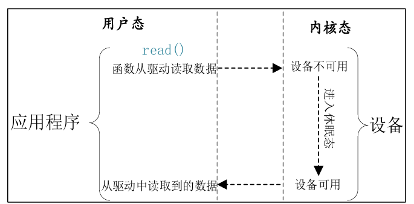
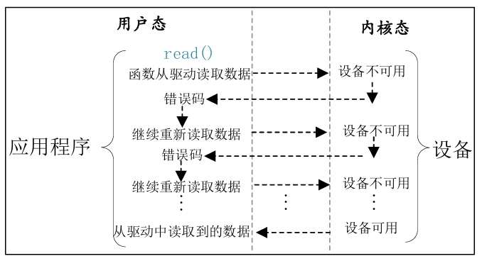

## 简介

对于IO并不是指代GPIO，而是指的是 Input和Output，也就是应用程序对驱动设备进行读写操作，假如说我们不能获取到设备资源，并且是阻塞IO的话，会一直等待着直到资源可获取。而非阻塞IO，则是以轮询的方式等待，直到资源可用。

阻塞IO访问示意图



非阻塞IO访问示意图



而阻塞和非阻塞的读取，在应用层的代码编写，只需要在open函数当中第二个参数加上O_NONBLOCK即可

```C
fd = open("/dev/xxx_dev", O_RDWR | O_NONBLOCK);
```

## 等待队列

等待队列就是内核中的“排队等通知”机制：现在没办法继续执行，就先睡眠；等条件满足了，别人再通知你继续执行。其为阻塞IO实现的一种方式

### 等待队列头

阻塞访问最大的好处就是当设备文件不可操作的时候进程可以进入休眠态，这样可以将CPU资源让出来。但是，当设备文件可以操作的时候就必须唤醒进程，一般在中断函数里面完成唤醒工作。Linux 内核提供了等待队列(wait queue)来实现阻塞进程的唤醒工作，如果我们要在驱动中使用等待队列，必须创建并初始化一个等待队列头，等待队列头使用结构体wait_queue_head 表示，wait_queue_head 结构体定义在文件include/linux/wait.h 中

```C
34 struct wait_queue_head { 
35  spinlock_t        lock; 
36  struct list_head  head; 
37 }; 
38 typedef struct wait_queue_head wait_queue_head_t;
```

定义好队列头就要对其初始化

```C
void init_waitqueue_head(struct wait_queue_head *wq_head)
```

参数wq_head就是要初始化的等待队列头。也可以使用宏 DECLARE_WAIT_QUEUE_HEAD 来一次性完成等待队列头的定义的初始化。

### 等待队列项

等待队列头就是一个等待队列的头部，每个访问设备的进程都是一个队列项，当设备不可用的时候就要将这些进程对应的队列项添加到等待队列里面。

```C
27 struct wait_queue_entry { 
28  unsigned int       flags; 
29  void               *private; 
30  wait_queue_func_t  func; 
31  struct list_head   entry; 
32 };
```

使用宏DECLARE_WAITQUEUE定义并初始化一个等待队列项

```C
DECLARE_WAITQUEUE(name, tsk)
```

name 就是等待队列项的名字，tsk 表示这个等待队列项属于哪个任务(进程)，一般设置为current ，在 Linux 内核中 current 相当于一个全局变量，表示当前进程。因此宏DECLARE_WAITQUEUE就是给当前正在运行的进程创建并初始化了一个等待队列项。

### 将队列项添加/移除等待队列头

当设备不可访问的时候就需要将进程对应的等待队列项添加到前面创建的等待队列头中，只有添加到等待队列头中以后进程才能进入休眠态。当设备可以访问以后再将进程对应的等待队列项从等待队列头中移除即可

```C
void add_wait_queue(struct wait_queue_head  *wq_head,  
					struct wait_queue_entry  *wq_entry)
```

* wq_head：等待队列项要加入的等待队列头。
* wq_entry：要加入的等待队列项。
* 返回值：无。

```C
void remove_wait_queue(struct wait_queue_head   *wq_head,  
					   struct wait_queue_entry  *wq_entry)
```

* wq_head：要删除的等待队列项所处的等待队列头。
* wq_entry：要删除的等待队列项。
* 返回值：无。

### 等待唤醒

```C
void wake_up(struct wait_queue_head  *wq_head) 
void wake_up_interruptible(struct wait_queue_head *wq_head)
```

参数wq_head就是要唤醒的等待队列头，这两个函数会将这个等待队列头中的所有进程都唤醒。wake_up 函数可以唤醒处于TASK_INTERRUPTIBLE 和TASK_UNINTERRUPTIBLE 状态的进程，而wake_up_interruptible 函数只能唤醒处于TASK_INTERRUPTIBLE 状态的进程。

### 等待事件

除了主动唤醒以外，也可以设置等待队列等待某个事件，当这个事件满足以后就自动唤醒
等待队列中的进程


| API函数                                                         | 描述                                                                                                                                    |
| ----------------------------------------------------------------- | ----------------------------------------------------------------------------------------------------------------------------------------- |
| `wait_event(wq_head, condition)`                                | 等待条件`condition` 成立。如果条件为假，则将当前进程设置为 `TASK_UNINTERRUPTIBLE` 状态并进入睡眠，直到条件满足。                        |
| `wait_event_timeout(wq_head, condition, timeout)`               | 与`wait_event()` 类似，但增加超时限制，单位为 `jiffies`。返回 `0` 表示超时且条件仍为假；返回正数表示条件成立，通常为剩余的 `jiffies`。  |
| `wait_event_interruptible(wq_head, condition)`                  | 等待条件成立，期间将进程设置为`TASK_INTERRUPTIBLE` 状态。条件满足返回 `0`，等待被信号打断则返回 `-ERESTARTSYS`。                        |
| `wait_event_interruptible_timeout(wq_head, condition, timeout)` | 在可被信号打断的状态下等待条件成立，并设置超时时间。返回`0` 表示超时且条件未满足；正数表示条件成立；`-ERESTARTSYS` 表示等待被信号打断。 |

## 轮询

如果用户应用程序以非阻塞的方式访问设备，设备驱动程序就要提供非阻塞的处理方式，也就是轮询

### select函数

```C
int select(int    nfds,  
  		   fd_set   *readfds,  
  		   fd_set   *writefds, 
   		   fd_set   *exceptfds,  
   		   struct timeval  *timeout)
```

* nfds：所要监视的这三类文件描述集合中，最大文件描述符加1，因为fd是从0开始。
* readfds、writefds和exceptfds：这三个指针指向描述符集合，这三个参数指明了关心哪些
  描述符、需要满足哪些条件等等，这三个参数都是fd_set类型的，fd_set类型变量的每一个位
  都代表了一个文件描述符。readfds用于监视指定描述符集的读变化，也就是监视这些文件是否
  可以读取，只要这些集合里面有一个文件可以读取那么seclect就会返回一个大于0的值表示文
  件可以读取。如果没有文件可以读取，那么就会根据timeout参数来判断是否超时。可以将readfs
  设置为NULL，表示不关心任何文件的读变化。writefds和readfs类似，只是writefs用于监视
  这些文件是否可以进行写操作。exceptfds用于监视这些文件的异常。


| API 函数                        | 描述                                                  |
| --------------------------------- | ------------------------------------------------------- |
| `FD_ZERO(fd_set *set)`          | 清空文件描述符集合。                                  |
| `FD_SET(int fd, fd_set *set)`   | 将文件描述符`fd` 加入集合。                           |
| `FD_CLR(int fd, fd_set *set)`   | 从集合中移除文件描述符`fd`。                          |
| `FD_ISSET(int fd, fd_set *set)` | 判断`fd` 是否在集合中，在则返回非 `0`，否则返回 `0`。 |

* timeout:超时时间，当我们调用select函数等待某些文件描述符可以设置超时时间，超时时
  间使用结构体timeval表示，结构体定义如下所示：

```C
struct timeval { 
  long    tv_sec;         /* 秒  */ 
  long    tv_usec;        /* 微妙  */  
};
```

当timeout为NULL的时候就表示无限期的等待

### poll函数

在单个线程中，select函数能够监视的文件描述符数量有最大的限制，一般为1024，可以修改内核将监视的文件描述符数量改大，但是这样会降低效率！这个时候就可以使用poll函数，poll函数本质上和select没有太大的差别，但是poll函数没有最大文件描述符限制

```C
int poll(struct pollfd  *fds,  
   		 nfds_t   nfds,  
   		 int    timeout)
```

* fds：要监视的文件描述符集合以及要监视的事件,为一个数组，数组元素都是结构体pollfd
  类型的，pollfd结构体如下所示：

```C
struct pollfd { 
 int   fd;      /* 文件描述符  */ 
 short events;    /* 请求的事件  */ 
 short revents;     /* 返回的事件  */ 
};
```

fd是要监视的文件描述符，如果fd无效的话那么events监视事件也就无效，并且revents
返回0。events是要监视的事件，可监视的事件类型如下所示：

```C
POLLIN   有数据可以读取。 
POLLPRI   有紧急的数据需要读取。 
POLLOUT  可以写数据。 
POLLERR  指定的文件描述符发生错误。 
POLLHUP  指定的文件描述符挂起。 
POLLNVAL  无效的请求。 
POLLRDNORM 等同于POLLIN
```

revents是返回参数，也就是返回的事件，由Linux内核设置具体的返回事件。

* nfds：poll函数要监视的文件描述符数量。
* timeout：超时时间，单位为ms。返回值：返回revents域中不为0的pollfd结构体个数，也就是发生事件或错误的文件描述符数量；0，超时；-1，发生错误，并且设置errno为错误类型。

### epoll函数

传统的selcet和poll函数都会随着所监听的fd数量的增加，出现效率低下的问题，而且poll函数每次必须遍历所有的描述符来检查就绪的描述符，这个过程很浪费时间。为此，epoll应运而生，epoll就是为处理大并发而准备的，一般常常在网络编程中使用epoll函数。

```C
int epoll_create(int size)
```

* size：从Linux2.6.8开始此参数已经没有意义了，随便填写一个大于0的值就可以。
* 返回值：epoll句柄，如果为-1的话表示创建失败。

epoll句柄创建成功以后使用epoll_ctl函数向其中添加要监视的文件描述符以及监视的事件，epoll_ctl函数原型如下所示：

```C
int epoll_ctl(int     epfd,  
    		  int     op,  
    		  int     fd, 
     		  struct epoll_event  *event)
```

* epfd：要操作的epoll句柄，也就是使用epoll_create函数创建的epoll句柄。
* op：表示要对epfd(epoll句柄)进行的操作，可以设置为：

```C
EPOLL_CTL_ADD 向epfd添加文件参数fd表示的描述符。
EPOLL_CTL_MOD 修改参数fd的event事件。
EPOLL_CTL_DEL  从epfd中删除fd描述符。
```

* fd：要监视的文件描述符。
* event：要监视的事件类型，为epoll_event结构体类型指针，epoll_event结构体类型如下所
  示：

```C
struct epoll_event { 
uint32_t     events;     /* epoll 事件 */  
epoll_data_t  data;      /* 用户数据   */ 
}; 
```

可选的事件

```C
EPOLLIN 
有数据可以读取。 
EPOLLOUT 可以写数据。 
EPOLLPRI  有紧急的数据需要读取。 
EPOLLERR 指定的文件描述符发生错误。 
EPOLLHUP 指定的文件描述符挂起。 
EPOLLET 设置epoll为边沿触发，默认触发模式为水平触发（也就是只要数据没读完就可以一直读）。 
EPOLLONESHOT 一次性的监视，当监视完成以后还需要再次监视某个fd，那么就需要将
fd 重新添加到epoll里面
```

* 返回值：0，成功；-1，失败，并且设置errno的值为相应的错误码。

一切都设置好以后应用程序就可以通过epoll_wait 函数来等待事件的发生，类似 select 函
数。epoll_wait 函数原型如下所示

```C
int epoll_wait(int     epfd,  
			   struct  epoll_event  *events, 
			   int     maxevents,  
			   int     timeout) 
```

* epfd：要等待的epoll。
* events：指向epoll_event 结构体的数组，当有事件发生的时候Linux内核会填写events，调
  用者可以根据events判断发生了哪些事件。
* maxevents：events 数组大小，必须大于0。
* timeout：超时时间，单位为ms。
* 返回值：0，超时；-1，错误；其他值，准备就绪的文件描述符数量。

因此简单来说epoll和select/poll的区别就是，epoll是监听那些需要监听的设备是否已经就绪，而select/poll则是轮询去检查设备是否已经就绪

### Linux驱动下的poll操作函数

当应用程序调用 select 或 poll 函数来对驱动程序进行非阻塞访问的时候，驱动程序file_operations 操作集中的 poll 函数就会执行。所以驱动程序的编写者需要提供对应的 poll 函数，poll 函数原型如下所示：

```C
unsigned int (*poll) (struct file *filp, struct poll_table_struct *wait) 
```

* filp：要打开的设备文件(文件描述符)。
* wait：结构体 poll_table_struct 类型指针，由应用程序传递进来的。一般将此参数传递给
  poll_wait 函数。
* 返回值:向应用程序返回设备或者资源状态，可以返回的资源状态如下：

```C
POLLIN   有数据可以读取。 
POLLPRI  有紧急的数据需要读取。 
POLLOUT  可以写数据。 
POLLERR  指定的文件描述符发生错误。 
POLLHUP  指定的文件描述符挂起。 
POLLNVAL 无效的请求。 
POLLRDNORM 等同于POLLIN，普通数据可读 
```

我们需要在驱动程序的poll函数中调用poll_wait函数，poll_wait函数不会引起阻塞，只是将应用程序添加到poll_table中，poll_wait函数原型如下

```C
void poll_wait(struct file * filp, wait_queue_head_t * wait_address, poll_table *p) 
```

参数 wait_address 是要添加到 poll_table 中的等待队列头，参数 p 就是 poll_table，就是file_operations 中 poll 函数的 wait 参数
