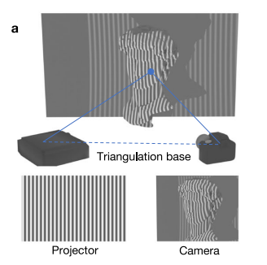
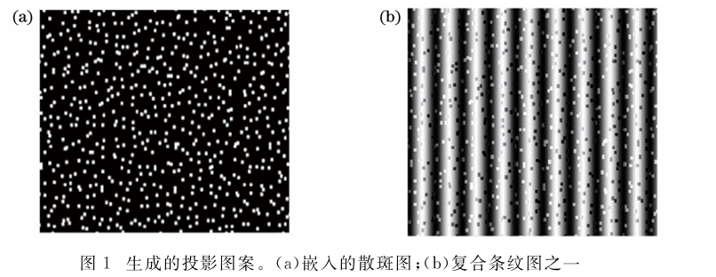
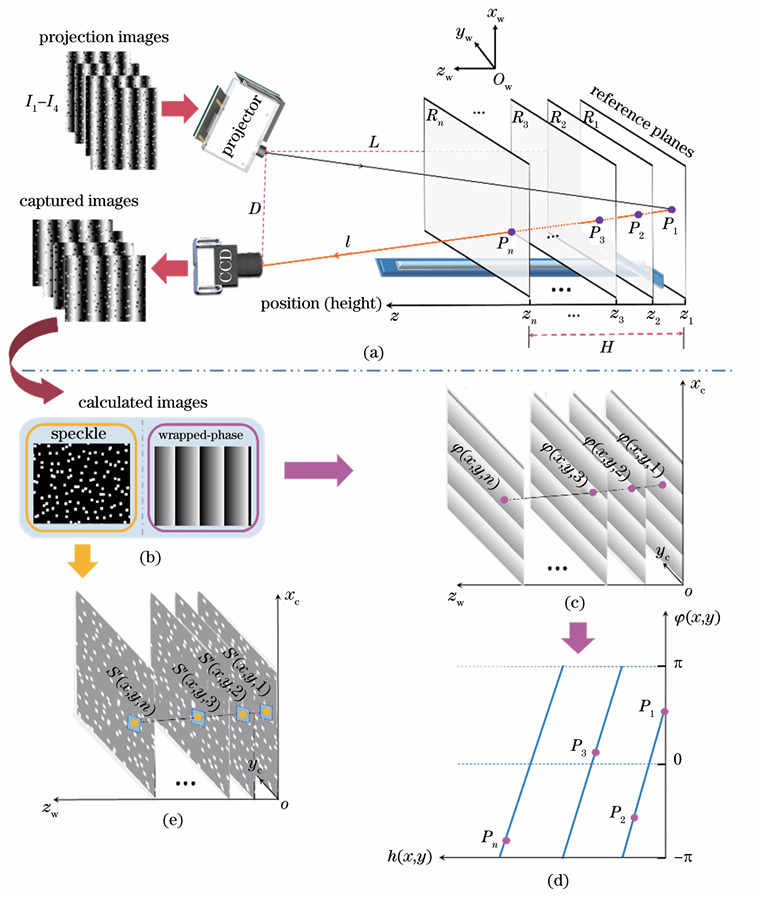
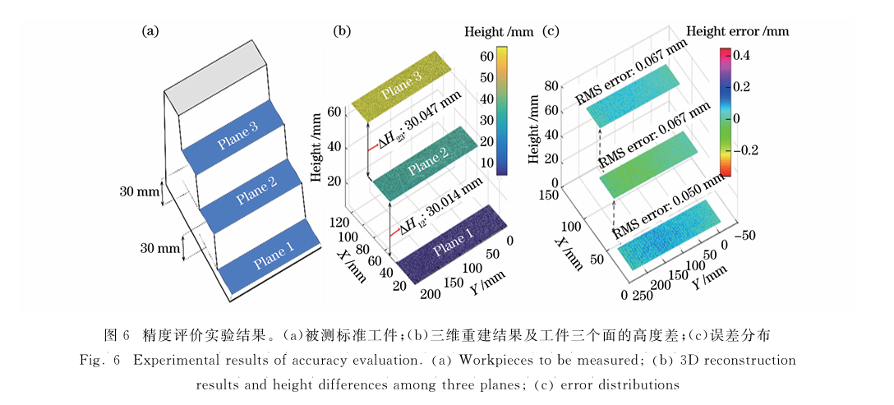

## 论文信息

* 期刊: 光学学报
* 学校: 四川大学
* 出版时间: 2021年3月
* 论文下载链接: [链接](https://www.researching.cn/ArticlePdf/m00006/2021/41/5/0512003.pdf?utm_source=chatgpt.com)

## 引言

对于我们常见的结构光三维重建方案，基于单目摄像机加上投影仪配置，或者是双目摄像机加上投影仪配置。其基本的重建流程为投影仪投射正弦条纹，以多步相移的方式获得每个像素的包裹相位，并通过对周期性正弦函数进行编码并转化为投射格雷码的方式，将包裹相位转化为绝对相位，之后使用三角解算的方式解算出深度信息

原方案缺点:

* 投射多组图像解算时间周期长，对于动态场景重建不友好
* 格雷码解算强依赖静态场景具有周期性混叠导致错位现象发生

此论文创新点:

* 在原有的正弦条纹人为增加散斑图以代替包裹相位到绝对相位的转化过程
* 以空间换时间 建立LUT表，加速计算

## 详细过程

由于原结构光三维重建的方案是通过包裹相位转化为绝对相位进而计算出深度信息这层逻辑，因此包裹相位是和深度关系具有强绑定的关系在，但是现在摒弃这层逻辑，转而替代方案为散斑图案。因此需要将包裹相位借助散斑图案和深度建立联系。

首先确定一下背景，由于每个包裹相位具有 2π 的周期性，因此同一个包裹相位可能对应不同的空间高度 ( 即指物体表面距离参考方向的深度)为了解决这个问题，引入散斑图叠加正弦条纹的方案， 以局部散斑差异的方式，对歧义的空间高度的像素点进行精确匹配。

而可以通过投放嵌入散斑图的正弦条纹，以四步相移的方式可以解调出包裹相位 $\phi(x,y)$ 以及 得到 散斑 $S(x,y)$ 具体公式如下

$$
\phi(x,y)=\arctan\left(
\frac{I_1(x,y)-I_2(x,y)}
{I_4(x,y)-I_3(x,y)}
\right)
$$

$$
S'(x,y)=
\arctan\left(
\frac{
I_1(x,y)+I_2(x,y)-I_3(x,y)-I_4(x,y)
}{
-I_1(x,y)+I_2(x,y)-I_3(x,y)+I_4(x,y)+\varepsilon
}
\right)
$$

因此每个像素都需要包含 $(x,y, \phi, S, Z)$ 信息

* x: 图像像素纵坐标
* y: 图像像素横坐标
* $\phi$: 包裹相位
* S: 解调散斑
* Z: 像素深度

但是现在有个问题，我们可以在实际实验的过程当中根据投放嵌入散斑的正弦条纹获得 包裹相位和 解调散斑的信息, 但是我们并不知道深度信息。因此我们需要提前建立每个包裹相位对应的深度信息的建模，论文采取的是利用不同参考平面高度对应的截断相位，逐像素建立“截断相位—高度 LUT”

具体操作为参考平面移动到不同已知深度 $Z_1, Z_2, \dots, Z_n$。每到一个深度，都在每个相机像素 $(x,y)$ 上计算一次包裹相位 $\phi(x,y)$。因此，对于某个固定像素 $(x,y)$，可以得到如下对应关系：

$$
Z_1 \leftrightarrow \phi_1(x,y)
$$

$$
Z_2 \leftrightarrow \phi_2(x,y)
$$

$$
\cdots
$$

$$
Z_n \leftrightarrow \phi_n(x,y)
$$

但是包裹相位具有 2π 周期性 ，因此很有可能出现下述例子情况

$$
\phi = 0.4\pi \rightarrow \{Z_1, Z_5, Z_9\}
$$

但是没有关系，在实际的标定过程中，每个包裹相位对应的深度信息都会绑定一层解调散斑信息，用于唯一化匹配

$$
Z_i \leftrightarrow \left\{\phi_i(x,y),\;S_i'(x,y)\right\}
$$

因此上述前置标定操作搭建起了LUT粗略查找表（简单来说就是每个包裹相位对应深度，深度又有对应解调散斑信息的 数据库），以用于实际测量过程

因此前置LUT查找表已经具备，即可对实际测量的物体进行深度复原，通过投射嵌入散斑的正弦条纹，获得$ (x,y, \phi, S, Z)$ 此时Z信息未知，其它信息已知，则可以在LUT进行查表对应像素的深度信息为多少，但是会遇到包裹相位对应多个Z的情况，因此需要一种匹配算法常见匹配算法有ZNCC和NCC，而根据论文实验可得NCC的匹配效率快于ZNCC 约1.5倍

$$
C_{\mathrm{NCC}}=
\frac{
\sum\sum f(x,y)g(x',y')
}{
\sqrt{
\sum\sum [f(x,y)]^2
\sum\sum [g(x',y')]^2
}
}
$$

也就是在计算包裹相位和散斑信息后，在数据库找到包裹相位匹配的多个深度信息Z，使用NCC的方式确定唯一的Z。 以此完成整幅图像的深度信息的构建，也就可以复原三维模型

## 性能分析

- 测量范围：约 300 mm × 150 mm × 80 mm
- 测量精度：RMS 误差约 0.050~0.067 mm，整体优于 0.07 mm
- 投影刷新率：100 frame/s
- 单次三维测量图案数：4 幅
- 动态场景：可正确重建自由移动、伸展的人手
- 散斑匹配算法：NCC
- NCC 高度重建错误点比例：约 1.55%
- LUT 候选散斑数量：约 9~12 个，平均约 10 个
- 相比 160 个参考散斑全搜索，NCC 相关计算速度提升 10 倍以上

## 问题及其优化点

1. 对于前置的标定过于繁琐，是否可以通过标定几个点的方式，最小二乘线性拟合等算法拟合
2. 标定结果是否能与系统几何绑定， 建立显式几何模型，把“数据标定”转成“模型参数标定”
